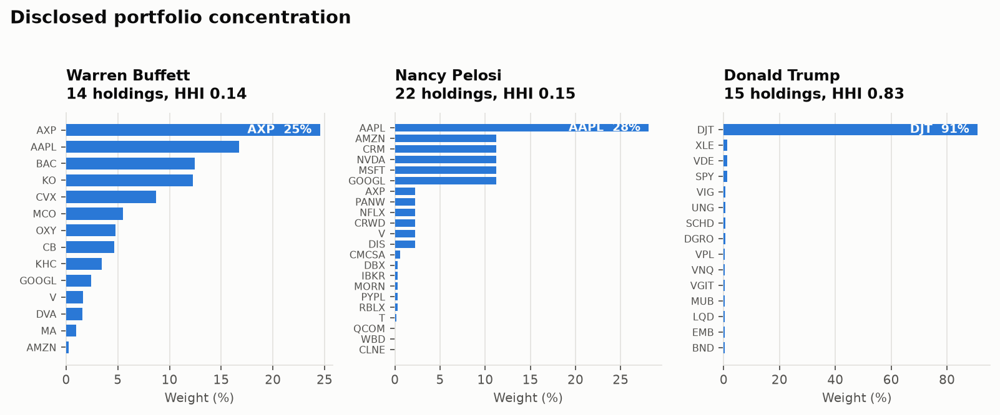
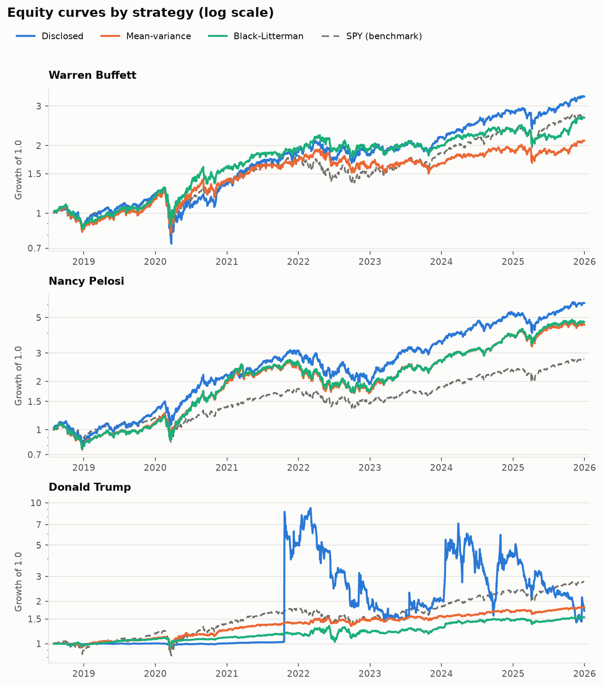
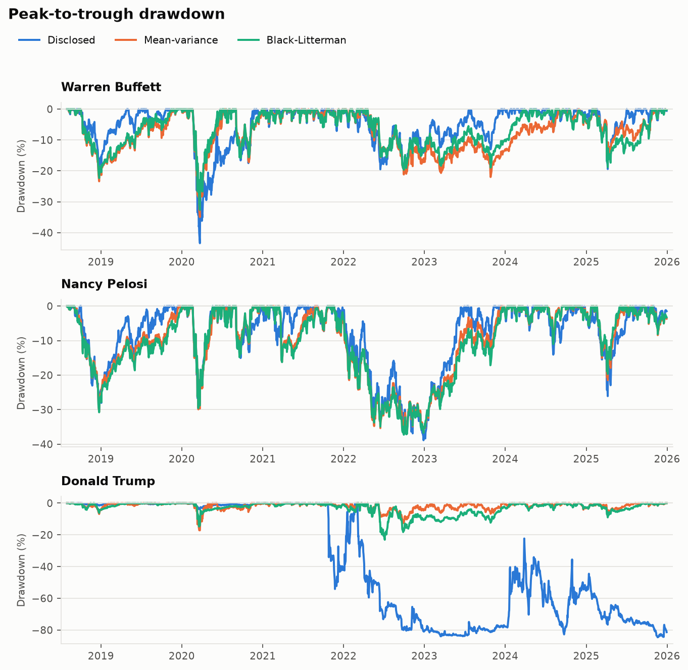
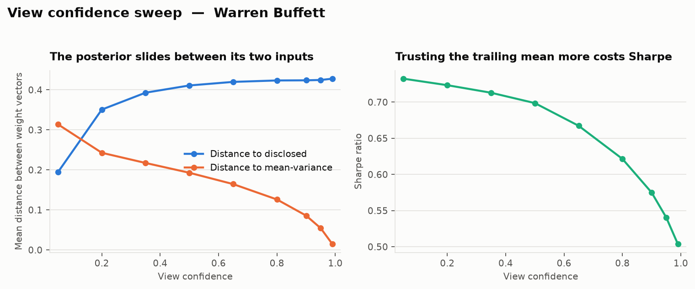
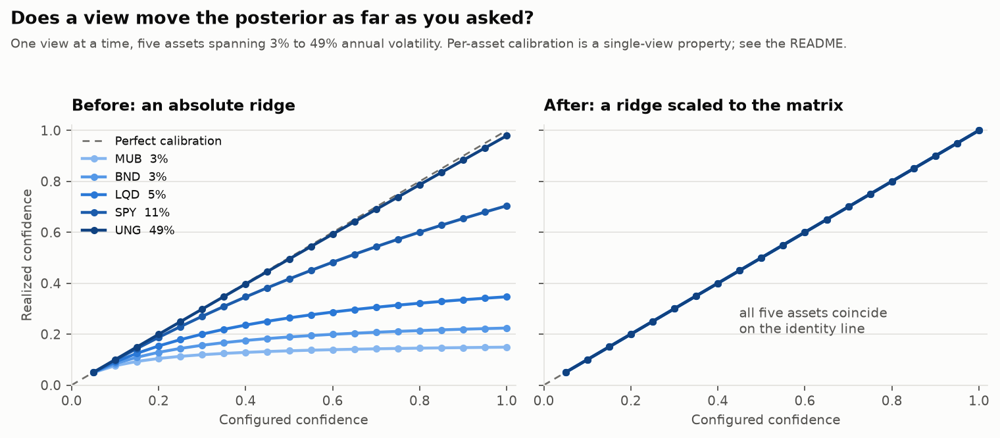

# portfolio-optimization-black-litterman

Black-Litterman case-study framework for evaluating publicly disclosed portfolios from notable figures.

## Project Question
Can a Black-Litterman overlay improve portfolio quality relative to:
1. The disclosed portfolio itself
2. A mean-variance (sample-estimated) baseline

## Implemented Capabilities
- Disclosure and price ingestion with schema validation and descriptive error messages.
- Latest disclosed portfolio reconstruction by person aliases.
- Rolling rebalancing backtest engine (lookback-based, no look-ahead application).
- Strategy comparison:
  - `disclosed` (static disclosed weights),
  - `mean_variance` (sample-estimated Markowitz),
  - `black_litterman` (equilibrium + views posterior; explicit pick-matrix views per case study).
- Metrics: annual return/volatility, Sharpe, Sortino, max drawdown, HHI concentration, turnover.
- CLI pipeline with structured logging (`--verbose` flag) that writes per-case outputs to `reports/output/<person>/`.
- Four notebooks with visual diagnostics, strategy comparison, sensitivity analysis, and benchmark attribution.
- Configurable `view_confidence` parameter exposed via YAML and `BacktestConfig`.
- Explicit absolute and relative views with per-view confidence, defined in YAML per case study.

## Important Caveats
- Public disclosures are delayed, incomplete, and sometimes approximate.
- Disclosure quality is source-dependent; conclusions are only as good as the input coverage.
- This repo is for research only, not investment advice.

See [Assumptions and Limitations](#assumptions-and-limitations) for the modelling choices
that most affect how the results should be read.

## Known Model Limitation

The BL posterior assumes multivariate Gaussianity in both returns and views. Equity
return distributions exhibit significant excess kurtosis and left-tail asymmetry,
particularly during stress periods directly visible in this backtest — the 2020 COVID
drawdown and the 2022 rate shock. A production-grade system would replace the Gaussian
prior with Meucci's Entropy Pooling / Copula Opinion Pooling framework, which separates
the marginal distributions from the dependence structure and allows views to be expressed
on arbitrary statistics including implied volatility.

## Repository Layout
```text
portfolio-optimization-black-litterman/
  configs/                   # Case-study and backtest parameters (incl. view_confidence, views)
  docs/
    figures/                 # Plots embedded in this README (light + dark variants)
  data/
    raw/
      disclosures/           # Input holdings disclosures CSV
      prices/                # Input price history CSV
  notebooks/                 # Visual walkthrough notebooks
  reports/
    templates/               # Markdown report templates
    output/                  # Generated case-study artifacts
  scripts/
    make_figures.py          # Regenerates docs/figures/
    run_case_study.py        # CLI entrypoint
  src/portfolio_bl/
    backtest/                # Rolling backtest and metrics
    data/                    # Disclosure + price loaders
    models/                  # BL posterior, pick-matrix views, mean-variance logic
    pipeline.py              # End-to-end experiment runner
  tests/                     # Unit + integration tests (132 tests)
```

## Input Data Schemas
### Disclosures CSV
Required columns:
- `person`
- `as_of_date` (YYYY-MM-DD)
- `ticker`
- `value_usd`

Optional column:
- `source`

### Prices CSV
Required columns:
- `date` (YYYY-MM-DD)
- `ticker`
- `close`

## Environment and Setup

Either route works. The conda route creates an isolated environment named `portfolio-bl`
from `environment.yml`; the pip route installs into an interpreter you already have.

```bash
# conda
conda env create -f environment.yml
conda activate portfolio-bl
python -m pip install -e '.[dev,notebooks]'

# or pip only, into an existing Python 3.10+ interpreter
python -m pip install -e '.[dev,notebooks]'
```

The editable install matters: `pyproject.toml` puts the package under `src/`, and both the
CLI and the notebooks import `portfolio_bl` by name.

**Nothing here is version-pinned.** `environment.yml` and `pyproject.toml` both specify only
lower bounds (`python>=3.10`, `numpy>=1.26`, `pandas>=2.1`), so a fresh solve tracks whatever
is current. The figures in this README were produced on Python 3.14.7 with NumPy 2.5.3 and
pandas 3.0.5. If you need byte-identical reproduction, pin your own versions; the repo will
not do it for you.

## Quick Start
```bash
cd portfolio-optimization-black-litterman
python -m pip install -e '.[dev,notebooks]'
pytest -q
python scripts/run_case_study.py --person buffett
python scripts/run_case_study.py --person pelosi
python scripts/run_case_study.py --person trump
```

Pass `--verbose` to enable debug-level logging:
```bash
python scripts/run_case_study.py --person buffett --verbose
```

Generated outputs include:
- `summary.csv`
- `equity_curve.csv`
- `strategy_returns.csv`
- `weights_<strategy>.csv`
- `metadata.csv`

All written under `reports/output/<person>/`.

## Selected Results

Every figure below comes from the bundled dataset and the shipped configuration (6-period
lookback, month-end rebalancing, `view_confidence: 0.65`). Regenerate the tables with
`python scripts/run_case_study.py --person <key>` and the plots with
`python scripts/make_figures.py`.

### Dataset at a glance

| | |
|---|---:|
| Adjusted daily closes | 90,298 rows |
| Tickers | 46 |
| Price coverage | 2018-01-02 to 2025-12-30 (2,009 trading days) |
| Disclosure rows | 51 across 3 people |
| Backtest window | 2018-08-01 to 2025-12-30 (1,864 days after lookback warm-up) |

### The disclosed portfolios

| Person | Snapshot | Holdings | Largest position | HHI |
|---|---|---:|---|---:|
| Warren Buffett | 2025-12-31 | 14 | AXP at 24.6% | 0.136 |
| Nancy Pelosi | 2024-12-31 | 22 | AAPL at 28.1% | 0.145 |
| Donald Trump | 2024-12-31 | 15 | DJT at 91.0% | 0.828 |

Every disclosed ticker has price history, so no holding is dropped from any backtest.

<picture>
  <source media="(prefers-color-scheme: dark)" srcset="docs/figures/disclosed-concentration-dark.png">
  
</picture>

The Trump panel uses a different horizontal scale from the other two. The HHI figure in each
title is scale-free and comparable across all three.

### Strategy comparison

| Person | Strategy | Annual return | Annual vol | Sharpe | Max drawdown | Turnover |
|---|---|---:|---:|---:|---:|---:|
| Buffett | disclosed | 17.5% | 23.5% | 0.75 | -43.4% | 0.0% |
| Buffett | mean-variance | 10.6% | 21.4% | 0.49 | -34.9% | 36.2% |
| Buffett | Black-Litterman | 14.2% | 21.2% | 0.67 | -32.7% | 30.1% |
| Pelosi | disclosed | 27.9% | 27.6% | 1.01 | -38.9% | 0.0% |
| Pelosi | mean-variance | 22.6% | 25.1% | 0.90 | -36.7% | 32.1% |
| Pelosi | Black-Litterman | 23.2% | 25.1% | 0.93 | -37.3% | 29.2% |
| Trump | disclosed | 7.5% | 147.2% | 0.05 | -84.6% | 0.0% |
| Trump | mean-variance | 8.4% | 10.5% | 0.80 | -17.2% | 28.0% |
| Trump | Black-Litterman | 6.0% | 11.5% | 0.52 | -23.1% | 26.6% |
| *benchmark* | *SPY, same window* | *14.6%* | *19.7%* | *0.74* | *-33.7%* | *n/a* |

<picture>
  <source media="(prefers-color-scheme: dark)" srcset="docs/figures/equity-curves-dark.png">
  
</picture>


### Reading the table

- **The overlay does not beat the disclosed book for Buffett or Pelosi**, and the honest
  explanation is hindsight. A single snapshot dated 2025-12-31 (Buffett) or 2024-12-31 (the
  others) is held all the way back to 2018, so the names are selected by having survived to
  the snapshot date. Treat the `disclosed` column as an upper bound contaminated by
  look-ahead, not as a fair competitor.
- **Pelosi's disclosed book returned 27.9% a year against SPY's 14.6%**, with a comparable
  drawdown. The same hindsight caveat applies in full.
- **Trump's 147% volatility and -84.6% drawdown are one position.** DJT is 91% of that
  snapshot and did not trade until late 2021, so the curve sits flat near 1.0 and then
  inherits the ticker's swings almost directly. Both optimisers re-estimate weights from the
  lookback window and never take on that concentration, which is why mean-variance turns a
  0.05 Sharpe into 0.80.
- **Black-Litterman lands between its two inputs in every case**, which is what the model is
  built to do rather than a disappointment.

<picture>
  <source media="(prefers-color-scheme: dark)" srcset="docs/figures/drawdowns-dark.png">
  
</picture>


### View confidence interpolates between the two baselines

Because the equilibrium prior is implied from the disclosed weights, confidence sweeps the
posterior from one baseline to the other. Distances are the mean L2 norm between weight
vectors across rebalances (Buffett, real data).

| Confidence | Distance to disclosed | Distance to mean-variance | Sharpe | Turnover |
|---:|---:|---:|---:|---:|
| 0.01 | 0.063 | 0.390 | 0.75 | 5.9% |
| 0.20 | 0.351 | 0.243 | 0.72 | 24.9% |
| 0.40 | 0.400 | 0.209 | 0.71 | 27.7% |
| 0.65 | 0.420 | 0.165 | 0.67 | 30.1% |
| 0.80 | 0.423 | 0.126 | 0.62 | 31.7% |
| 0.95 | 0.425 | 0.054 | 0.54 | 34.5% |
| 0.999 | 0.429 | 0.002 | 0.49 | 36.2% |

Three things worth noting. Sharpe falls monotonically as confidence rises, so on this data
trusting the trailing sample means more is actively harmful, and turnover rises with it.
The blend reaches its endpoints cleanly: at confidence 0.999 the distance to the
mean-variance portfolio is 0.002, so a fully trusted view really does recover that
portfolio. And the Black-Litterman strategy is best understood as a tunable blend of the
other two rather than an independent third model.

<picture>
  <source media="(prefers-color-scheme: dark)" srcset="docs/figures/confidence-sweep-dark.png">
  
</picture>


> **The confidence axis is calibrated for a single view.** Earlier versions added a fixed absolute `1e-6` to
> the view-uncertainty matrix. That matrix holds per-period variances: across all 270
> estimation windows an absolute view's entry spans `5e-8` to `7e-4`, and a relative view
> between two similar bond funds goes lower still, down to `1.9e-8` for BND against VGIT.
> The fixed constant therefore ranged from negligible at the top of that range to 51 times
> the quantity it was meant to stabilise at the bottom, and the confidence a user configured
> was not the one they got: a configured 0.65 realised as 0.14 for MUB and 0.64 for UNG. The
> regularisation is now proportional to each asset's own variance, so a single absolute view
> realises its configured value for every asset to within `2e-6`, and exactly when the ridge
> is disabled. A single *relative* view between two highly correlated assets is looser, since
> `Omega` is derived from the unregularised covariance while the posterior uses the
> regularised one: the error grows roughly as `ridge / (1 - rho)`, reaching `2e-5` at a
> correlation of 0.99. The sweep above stacks one view per asset, where per-asset
> calibration does not hold and `c` acts as a dial on the set of views rather than a per-asset
> guarantee; see [Methodology](#methodology). The figures above are post-fix; the correction
> moved the Trump mean-variance Sharpe from 0.85 to 0.80, that case study having the
> worst-conditioned covariance.

<picture>
  <source media="(prefers-color-scheme: dark)" srcset="docs/figures/confidence-calibration-dark.png">
  
</picture>


## Methodology

What the three strategies actually compute. All of it lives in `src/portfolio_bl/models/`
and `src/portfolio_bl/pipeline.py`.

### The estimation window

Every model quantity comes from one rolling window of daily arithmetic returns.

- Returns are `pct_change()` on the pivoted adjusted-close matrix, so `mu`, `Sigma`, `pi`
  and `q` are all in **daily** units. Nothing is annualised before the optimiser;
  annualisation happens only in the metrics layer.
- Rebalance dates are the last trading day of each month (`rebalance_frequency: ME`).
- `lookback_periods: 6` counts **rebalance intervals, not rows**. The training slice runs
  from the month-end six rebalances earlier up to, but excluding, the current one, which is
  122 to 129 trading days on the bundled data.
- The first six month-ends are warm-up, leaving **90 rebalances** per case study.
- `estimate_mean_cov` takes the plain sample mean and sample covariance of that slice. No
  shrinkage, no exponential weighting, no factor structure.
- Any ticker with even one missing return inside the window is dropped from that window and
  carries zero weight there. On the bundled data this affects two case studies: Trump loses
  DJT from 45 of 90 windows, and Pelosi loses RBLX from 38, CRWD from 17 and DBX from 2.

### `disclosed`

Weights are `value_usd / value_usd.sum()` at the person's latest `as_of_date`, restricted to
tickers that also have price history, then renormalised. The same vector is returned at
every rebalance.

### `mean_variance`

`mu` and `Sigma` from the window, passed straight to `long_only_markowitz_weights`. The
`risk_aversion` setting is never read on this path.

### `black_litterman`

**1. The equilibrium prior.** `implied_equilibrium_returns` computes

```
pi = lambda * Sigma * w_mkt
```

where `lambda` is `backtest.risk_aversion` and `w_mkt` is **the disclosed portfolio weights,
renormalised over the tickers with data in this window**, not true market-capitalisation
weights. This is the single most consequential modelling choice in the repo. Textbook
Black-Litterman asks what returns would make *the market* efficient; this asks what returns
would make *this person's book* efficient. The prior is therefore the disclosed portfolio
itself, and the posterior blends the disclosed book with the views rather than the market
with the views.

The direct consequence is that **with no views the model returns the disclosed portfolio.**
The posterior collapses to `mu_BL = pi` and `Sigma_BL = (1 + tau) * Sigma`, and the solver's
unconstrained step is then proportional to `w_mkt`, which survives renormalisation.

**2. The posterior.** `black_litterman_posterior` implements

```
M        = inv(tau * Sigma) + P' * inv(Omega) * P
mu_BL    = inv(M) * ( inv(tau * Sigma) * pi  +  P' * inv(Omega) * q )
Sigma_BL = Sigma + inv(M)
```

- `Sigma` (n x n): window sample covariance, plus a relative ridge (see below).
- `P` (k x n): the pick matrix, one row per view.
- `q` (k,): the per-period return each view asserts for its row of `P`.
- `Omega` (k x k): view uncertainty. Larger entries mean a less trusted view.
- `tau` (`0.05`): scales the prior mean's uncertainty as `tau * Sigma`.

Inverses are `np.linalg.pinv`, not `solve`. `mu_BL` is a precision-weighted average of `pi`
and `q`. `Sigma_BL` is always larger than `Sigma`, because parameter uncertainty is added to
the risk estimate rather than subtracted from it.

**3. `Omega` from a confidence scalar.** Instead of asking for a covariance,
`diagonal_omega_from_confidence` derives one from a confidence `c` in `(0, 1]`:

```
Omega = diag( diag( P (tau * Sigma) P' ) * (1 - c) / c )
```

Each view's uncertainty is its own prior variance under the model, scaled by `(1-c)/c`. At
`c = 0.5` that factor is exactly 1. As `c` approaches 1, `Omega` goes to zero; as `c`
approaches 0, the view is ignored. `Omega` is diagonal by construction, so view errors are
assumed independent even when two views overlap on the same asset.

**What `c` does and does not promise.** Each view realises exactly the fraction `c` when
`P(tau*Sigma)P'` is diagonal, that is when the views' projections are uncorrelated under the
prior. `Omega` is diagonal by construction, so that is precisely the condition under which it
can match the prior term view by view. Two cases satisfy it: a *single* view, where the
posterior moves exactly `c` of the way regardless of the asset's volatility, so a lone view
set to 0.65 lands 65% of the way there whether it names a municipal bond fund or a meme
stock; and the identity block of sample-mean views over a diagonal `Sigma`.

It does **not** hold in the shipped default, where `use_sample_mean_views: true` stacks one
view per asset over a correlated `Sigma`. Measured on the last Buffett estimation window at a
configured 0.65, the per-asset fraction runs from -0.23 to 3.48: some assets overshoot their
view several times over, and others move away from it because a correlated neighbour's view
outweighs it. Nor does a diagonal `Sigma` rescue it once two pick rows touch the same asset,
which is what happens as soon as you add an explicit view on a ticker the sample-mean block
already covers. With `Sigma = diag(4e-4, 4e-4, 9e-4)` and one relative row stacked under the
identity block, the realised fractions are 0.79, 0.79, 0.65 and 0.79 against a configured 0.65.

This is ordinary Bayesian updating with correlated evidence rather than a defect: the
posterior is pooling what the views jointly say. But it does mean "0.65 means 65% of the way
for this asset" is the wrong mental model outside the two cases above. Read `c` there as a
dial on how much the views as a set move the posterior. Idzorek's method, which solves for
the `Omega` that achieves a target tilt, is the standard way to recover a per-view
interpretation under stacking; it is not implemented here.

**4. The default views are the trailing sample means.** With `use_sample_mean_views: true`
the pipeline stacks one absolute view per asset:

```
P = I (n x n)     q = mu, the lookback sample mean per asset     c = view_confidence
```

Out of the box the "analyst view" is simply the last six months of realised average return,
asserted asset by asset. That is why the strategy behaves as a tunable blend of `disclosed`
(the prior) and `mean_variance` (the views), and why raising confidence on this data hurts:
it means trusting a six-month trailing mean more. Explicit YAML views are appended as extra
rows below the identity block.

### Two parameters that do less than they appear to

**`risk_aversion` does not affect the final weights.** `long_only_markowitz_weights`
renormalises to sum 1, and any positive rescaling of expected returns cancels in that step.
Multiplying `mu` by 0.5, 2.5 or 10 returns bit-identical weights. `lambda` scales `pi`, so
it too washes out.

**`tau` cancels out of the posterior mean entirely.** Because `Omega` is derived from the
same `tau * Sigma`, `tau` appears on both sides and drops out: `mu_BL` is identical to machine
precision for `tau = 0.005` and `tau = 5`. Since the regularisation became relative this holds
with the ridge active, because the ridge on `Omega` is scaled by a quantity that carries `tau`
too. `tau` reaches the weights only through `Sigma_BL = Sigma + inv(M)`. End to end on the
Buffett case, moving `tau` from 0.05 to 0.5 shifts individual weights by at most 0.044, and to
5.0 by at most 0.448.
Treat `tau` as a knob on the posterior covariance, not on how strongly views are applied.
Use `view_confidence` for that.

### The long-only step is a projection, not a constrained optimum

Both optimisers finish in `long_only_markowitz_weights`:

```python
cov_reg = cov + np.diag(relative_ridge(cov, ridge))
raw = np.linalg.solve(cov_reg, mu)   # unconstrained: w proportional to inv(Sigma) mu
raw = np.clip(raw, 0.0, None)        # shorts clipped to zero
weights = raw / raw.sum()            # renormalise to sum 1
```

The system is solved with **no sign constraint and no budget constraint**. Negative entries
are then clipped and the survivors rescaled. That is a heuristic projection onto the
long-only simplex, not a solution of the constrained problem, and the two are not the same.
On a four-asset test case the projection returns a spread portfolio with mean-variance
utility 0.0626 where the true constrained optimum is a corner solution worth 0.0800. Read
the weights as "a long-only portfolio derived from the unconstrained solution", not as "the
optimal long-only portfolio".

An equal-weight fallback fires if the clipped weights sum to zero or less. It never triggers
on the bundled data across all 270 strategy-rebalances.

### Regularisation is relative, not absolute

Three places add a ridge to a covariance-like matrix to keep it invertible: `Sigma` and
`Omega` inside the posterior, and the covariance inside the long-only solve. In each the
`ridge` argument is a **dimensionless fraction**, and the amount added to a diagonal entry is
that fraction of the entry itself:

```python
cov_reg = cov + np.diag(relative_ridge(cov, ridge))   # ridge defaults to 1e-6
```

This matters for two reasons. An absolute constant means something different for daily
returns, whose variances sit near `1e-4`, than for monthly or annual ones, so it silently
changes the model's behaviour with the data frequency; scaling each entry by its own variance
makes the weights invariant to that choice. And within one universe, variances can span
orders of magnitude, so a single matrix-wide constant is negligible for a volatile equity and
dominant for a bond fund. Scaling per entry keeps the perturbation proportionate. An entry
whose variance is zero or not finite falls back to the mean of *all* the absolute diagonal
entries, zeros included, so an exactly singular covariance is still regularised. When that
mean is itself unusable, which happens for an all-zero diagonal and whenever any entry is NaN
or infinite, the helper falls back to an absolute `ridge`. Those are the only cases where the
old behaviour is retained.

## Backtest Semantics

The behaviour of `src/portfolio_bl/backtest/engine.py` and `metrics.py`. Figures are for the
shipped configuration on the bundled data.

### The walk-forward loop

At each eligible rebalance date the engine slices the preceding lookback window, calls the
strategy's weight function, and holds the result until the next rebalance. Rebalance dates
that do not appear in the return index are dropped silently. A date is eligible once six
rebalance dates precede it, which is why each case study yields 90 rebalances rather than 96.

### No look-ahead

Weights computed at a rebalance date are applied **from the next trading day**, never to the
decision bar itself. The training slice also excludes the decision bar. A strategy can
therefore never trade on the return it is about to earn. This is why the reported backtest
begins on 2018-08-01 rather than at the first price date of 2018-01-02: the first six
month-ends are consumed as warm-up.

One consequence worth knowing: `weight_history` is indexed by the **decision** date, not by
the date the weights took effect.

### Between rebalances the book is re-set every day

The engine computes each day's portfolio return as `w . r_t` using the same `w` until the
next rebalance. That is a constant-mix portfolio rebalanced back to target **every trading
day**, not a buy-and-hold of those weights. Drift is never allowed to accumulate. The
difference is material where one position dominates:

| Person | `disclosed` as run (daily constant mix) | Same weights, bought and held |
|---|---:|---:|
| Buffett | 17.5% return, 0.75 Sharpe | 17.3%, 0.74 |
| Pelosi | 27.9%, 1.01 | 31.1%, 1.04 |
| Trump | 7.5%, 0.05 | 3.7%, 0.02 |

Trump is the instructive case: re-setting daily keeps buying back into DJT as it falls,
which flatters the return by 3.8 points a year against simply holding.

Turnover is computed from `weight_history`, which only records rebalance dates, so these
daily re-weighting trades are invisible to it. The `disclosed` strategy's 0.0% turnover
means "the target weights never change", not "no trading occurs".

### Missing data

Two different mechanisms handle gaps, and they interact:

- **In estimation**, any column with a NaN anywhere in the window is dropped, so the ticker
  gets zero weight that period.
- **In the return accumulation**, a missing return is filled with `0.0`.

A ticker that has not listed yet therefore behaves like uncompensated cash: it neither gains
nor loses, but it still occupies its share of the portfolio. For the Trump case study, DJT
is 91% of the disclosed book and does not trade until 2021-09-30, so the `disclosed` curve
sits nearly flat for years before inheriting the ticker's swings. The optimisers cannot hold
DJT until the 2022-04-29 rebalance, the first with a complete lookback window.

### Metrics

- `periods_per_year` is inferred from the median gap between dates, resolving to 252 here.
- Annualised return is **geometric**; annualised volatility is the sample standard deviation
  scaled by the square root of `periods_per_year`.
- Sharpe and Sortino both assume a **zero risk-free rate**.
- Sortino returns NaN rather than infinity when a series has no negative returns, which keeps
  CSV output well defined.
- HHI is the sum of squared weights, averaged over rebalances. `1/n` is equal weight, `1.0`
  is a single position.
- Turnover is half the sum of absolute weight changes between consecutive rebalances,
  averaged. It is **measured but never charged**: no transaction costs enter the returns.

## Assumptions and Limitations

Beyond the caveats above, these are the choices most likely to mislead a reader of the
results. Each was verified against the bundled data.

**The disclosed benchmark is selected by hindsight.** One snapshot is held across the whole
backtest: Buffett's is dated 2025-12-31 and the other two 2024-12-31, against a window that
opens in August 2018. The constituents are therefore known to have survived to the snapshot
date, and positions closed earlier never appear. The `disclosed` column is an upper bound
contaminated by look-ahead, not a fair competitor. The same selection flows into the other
two strategies, which optimise within that same surviving universe.

**Nothing is charged for trading.** No transaction costs, slippage, taxes, borrow or
financing appear anywhere. Charging a plausible cost against measured turnover at each
rebalance gives:

| Case | Strategy | 0 bp | 10 bp | 25 bp | 50 bp |
|---|---|---:|---:|---:|---:|
| Buffett | mean-variance | 0.49 | 0.47 | 0.44 | 0.38 |
| Buffett | Black-Litterman | 0.67 | 0.65 | 0.62 | 0.57 |
| Pelosi | Black-Litterman | 0.93 | 0.91 | 0.88 | 0.84 |
| Trump | mean-variance | 0.80 | 0.76 | 0.71 | 0.62 |

Costs move every comparison in the static book's favour, because the overlays turn over 26
to 37 percent a month while the disclosed book reports zero. They do not overturn the
ordering within any case study.

**The prior is the book, not the market.** As described under Methodology, `pi` is implied
from the disclosed weights. These are not market equilibrium returns in the Black-Litterman
sense, and they should not be read as such.

**The covariance estimate is thin.** Each window holds about 126 daily rows against a
covariance with `n(n+1)/2` free parameters:

| Case | Assets | Rows per parameter | Median condition number |
|---|---:|---:|---:|
| Buffett | 14 | 1.20 | 89 |
| Pelosi | 22 | 0.50 | 145 |
| Trump | 15 | 1.05 | 15,329 |

Pelosi's estimate is under-determined outright, and Trump's is badly conditioned because a
highly volatile single name sits alongside bond funds. Shrinking a noisy sample estimate
toward a structured prior is exactly the problem Black-Litterman exists to address, which
makes these ratios context for the results rather than a reason to discard them.

**Disclosed values are range tiers, not exact holdings.** House and OGE filings report bands,
and the loader uses midpoints. The one exception matters: DJT is reported as "over $50M" and
enters at the lower bound of $50,000,000. Its 91% weight in the Trump book is therefore an
artefact of that convention as much as a fact about the portfolio, and every Trump figure
inherits that choice.

**Sharpe and Sortino assume a zero risk-free rate.** Over a window containing the 2022-2023
tightening cycle, that flatters every strategy's ratio in absolute terms, though it does not
change rankings within a case study.

**No statistical significance is computed anywhere.** There are no standard errors, no
bootstrap, and no significance tests. With 90 rebalances on a single historical path and
three portfolios, differences of a few hundredths of a Sharpe point should not be read as
evidence that one method beats another.

**`prices.csv` is a snapshot.** The refresh script in `data/raw/prices/README.md` passes no
end date, so re-running it extends coverage to the current day and changes the backtest
window, the rebalance dates and every figure in this README.

**Estimation noise is not the only thing the ridge used to hide.** Regularisation is now
proportional to each matrix's own scale, so the realised view confidence equals the
configured one and results no longer depend on whether returns are expressed daily or
monthly. See the note under [Selected Results](#selected-results) for what changed.

## Configuration

All backtest and model hyper-parameters live in `configs/case_studies.yaml`:

```yaml
backtest:
  lookback_periods: 6        # Historical periods used for estimation
  rebalance_frequency: ME    # Month-end rebalancing
  risk_aversion: 2.5         # λ in π = λΣw_mkt
  tau: 0.05                  # Prior uncertainty scalar
  view_confidence: 0.65      # BL analyst confidence (0, 1]
  use_sample_mean_views: true  # stack explicit views on the sample-mean views
```

`view_confidence` controls how strongly the analyst's sample-mean views override the
Black-Litterman equilibrium prior. Higher values reduce view uncertainty (Ω) and pull
the posterior mean toward the views. It can also be overridden programmatically:

```python
from portfolio_bl.config import load_config
from portfolio_bl.pipeline import run_case_study

cfg = load_config("configs/case_studies.yaml")
result = run_case_study(cfg, person_key="buffett", view_confidence=0.80)
```

## Expressing Views with a Pick Matrix

The Black-Litterman strategy accepts explicit analyst views per case study. Each view is
one row of the pick matrix `P` with its target return in `q`. Views live under the case
study in `configs/case_studies.yaml`:

```yaml
case_studies:
  buffett:
    person_label: Warren Buffett
    disclosure_aliases: ["buffett", "warren buffett", "berkshire hathaway"]
    views:
      - label: AAPL absolute
        assets: {AAPL: 1.0}            # absolute view: one ticker, coefficient 1
        annual_return: 0.08            # AAPL returns 8% per year
        confidence: 0.6                # optional; overrides backtest.view_confidence
      - label: CVX over OXY
        assets: {CVX: 1.0, OXY: -1.0}  # relative view: long side +1, short side -1
        annual_return: 0.02            # CVX beats OXY by 2% per year
```

Rules and behaviour:

- `assets` maps tickers to pick-matrix coefficients. An absolute view has one ticker with
  coefficient 1. A relative view has positive coefficients on the outperformers and negative
  coefficients on the underperformers; by convention each side sums to 1 in absolute value.
- `annual_return` is an annualised arithmetic return. It is divided by the number of return
  periods per year (252 for daily data) so it matches the scale of the covariance matrix.
- `confidence` is optional and per view, in `(0, 1]`. Views without it use
  `backtest.view_confidence`, as does the `view_confidence` override of `run_case_study`.
- By default (`use_sample_mean_views: true`) explicit views are stacked on top of the
  built-in sample-mean views, so the existing case studies are unchanged when no views are
  configured. Set `use_sample_mean_views: false` to optimise on explicit views alone. With
  that flag off and no views, the posterior equals the prior and the Black-Litterman
  weights track the disclosed portfolio.
- A view that references a ticker outside the case study's universe is ignored with a
  warning. A view naming a ticker without a *complete* lookback window of returns (a
  recently listed name) is not applied while that is true: the estimator drops any ticker
  with missing history from the window, so the ticker also carries zero Black-Litterman
  weight there. Both resume once the ticker has `lookback_periods` full periods of history,
  which is later than its first traded day.

Programmatic use:

```python
from portfolio_bl.models.views import View, build_view_matrices

views = [
    View({"AAPL": 1.0}, annual_return=0.08, confidence=0.6),
    View({"CVX": 1.0, "OXY": -1.0}, annual_return=0.02),
]
built = build_view_matrices(views, tickers, periods_per_year=252, default_confidence=0.65)
built.p_matrix, built.q_views, built.confidences  # P (k×n), q (k,), confidence per view (k,)
```

## Data Source Snapshot
- Buffett holdings come from Berkshire Hathaway's latest SEC 13F filing (as of `2025-12-31`) with a major-position ticker-mapped subset in this starter dataset.
- Pelosi holdings come from U.S. House financial disclosure report `10066169` (range-based values converted to midpoints).
- Trump holdings come from OGE 278e annual disclosure (range-based values converted to midpoints/lower bounds).
- Bundled `prices.csv` contains real adjusted daily closes sourced from Yahoo Finance (2018–2025); see `data/raw/prices/README.md` for the refresh script.

## Notebooks

Launch Jupyter with:
```bash
jupyter notebook
```

| # | Notebook | Description |
|---|----------|-------------|
| 1 | [Data Quality & Universe Overview](notebooks/01_data_quality_and_universe_overview.ipynb) | Schema checks, holdings coverage, portfolio composition |
| 2 | [Strategy Comparison Case Study](notebooks/02_strategy_comparison_case_study.ipynb) | Equity curves, drawdowns, BL weight evolution |
| 3 | [Black-Litterman Sensitivity](notebooks/03_black_litterman_sensitivity.ipynb) | View-confidence sweep and metric response |
| 4 | [Benchmark Attribution & Alpha Decomposition](notebooks/04_benchmark_attribution_alpha_decomposition.ipynb) | Benchmark betas, alpha decomposition, rolling alpha/beta |

Note: Notebook 4 uses ETF benchmarks when present (e.g. `SPY`, `XLK`, `XLE`, `XLF`) and falls back to transparent ticker proxies when benchmark tickers are missing.

## Data Status

Both input datasets now use real data.

| Dataset | Source | Coverage |
|---|---|---|
| `data/raw/disclosures/disclosures.csv` | SEC 13F, House FD, OGE 278e (public filings) | Buffett (2025-12-31), Pelosi (2024-12-31), Trump (2024-12-31) |
| `data/raw/prices/prices.csv` | Yahoo Finance via yfinance (`auto_adjust=True`) | 46 tickers, 2018-01-02 → 2025-12-30, ~90k rows |

To refresh prices with the latest data, see `data/raw/prices/README.md`.

## Output Files

`python scripts/run_case_study.py --person <key>` writes five CSVs to
`reports/output/<key>/`. Shapes below are for the Buffett case study.

| File | Shape | Index | Contents |
|---|---|---|---|
| `summary.csv` | 3 x 8 | `strategy` | One row per strategy, seven metric columns |
| `equity_curve.csv` | 1,864 x 4 | date | Cumulative NAV per strategy, starting at 1.0 |
| `strategy_returns.csv` | 1,864 x 4 | date | Daily portfolio return per strategy |
| `weights_<strategy>.csv` | 90 x 15 | `rebalance_date` | Weights per ticker at each rebalance |
| `metadata.csv` | 4 x 2 | key | Person label, snapshot date, asset count, universe |

All values are raw decimals, not percentages: `0.17535...` in `summary.csv` is 17.5%, and
`max_drawdown` is negative. The weight files carry genuine zeros, since the long-only
projection drops a large share of the universe in most windows.

Two traps worth repeating. `weights_<strategy>.csv` is indexed by the rebalance **decision**
date, one trading day before those weights take effect. And `reports/` is gitignored, so
these outputs and the report template are **not** tracked by git, while `data/` is.

## Development

```bash
pytest -q                       # 132 tests, about 2 seconds
ruff check src tests scripts    # linting
python scripts/make_figures.py  # regenerate docs/figures/ (needs matplotlib)
```

`make_figures.py` writes a light and a dark variant of every plot, which the README pairs
with `<picture>` so GitHub serves the one matching the reader's theme. Colours come from a
categorical palette whose first three slots are documented to clear the colour-vision
deficiency gates for every pair in both modes; the benchmark series is neutral grey rather
than a fourth hue because it is context, not a peer.

The suite is entirely self-contained: every fixture is synthetic and written to a temporary
directory, so the tests never read `data/raw/` or `configs/case_studies.yaml` and cannot be
broken by refreshing the price data.

| File | Tests | Covers |
|---|---:|---|
| `tests/test_black_litterman.py` | 19 | Equilibrium returns, omega, posterior, long-only weights |
| `tests/test_data_loaders.py` | 15 | Disclosure and price loading, cleaning, return matrix |
| `tests/test_metrics.py` | 20 | Frequency inference and every performance metric |
| `tests/test_pipeline_smoke.py` | 9 | End-to-end runs and config error paths |
| `tests/test_views.py` | 69 | Views, pick-matrix construction, config parsing, ridge calibration |

`ruff` currently reports 15 findings, all pre-existing and cosmetic: import ordering, three
unused imports in the older test modules, unsorted `__all__` lists, a deprecated import path,
a non-executable shebang, and one exception-type preference that is deliberate. Thirteen are
auto-fixable with `--fix`. None touch model logic.

## Current Status and Next Steps
- Extend benchmark/factor set (e.g. factor-model attribution against Fama-French).
- Add transaction-cost and slippage assumptions to the backtest engine.
- Add automated figure export from notebooks to `reports/output/figures/`.
