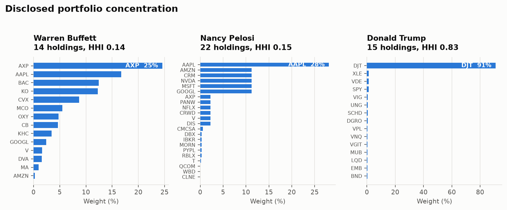
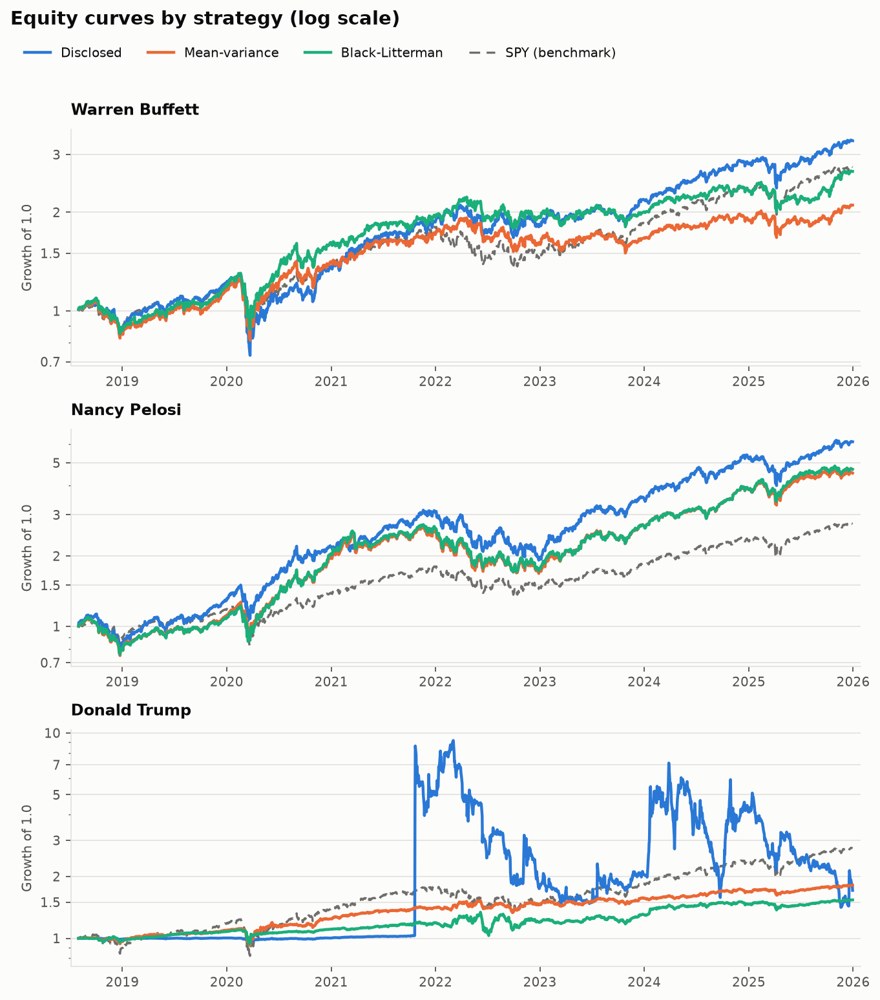
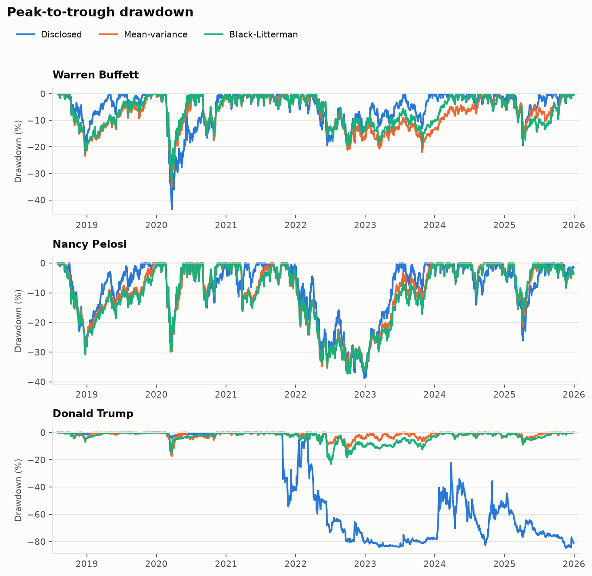
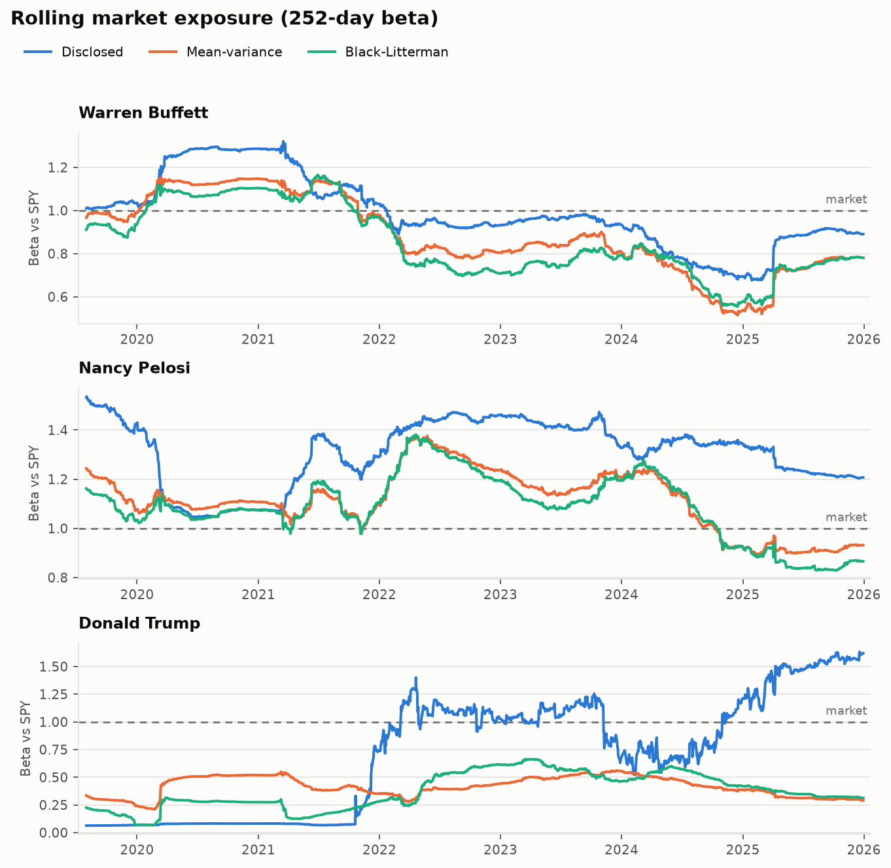
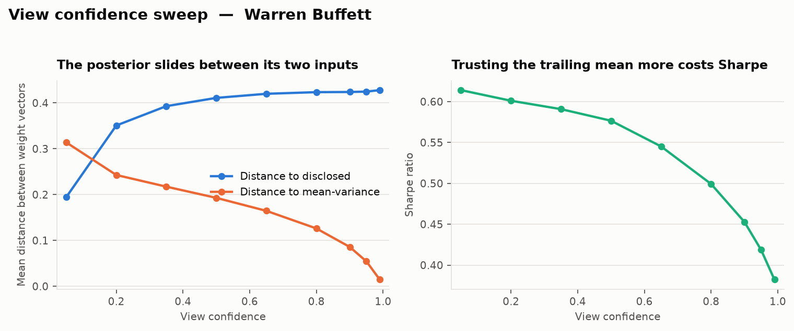
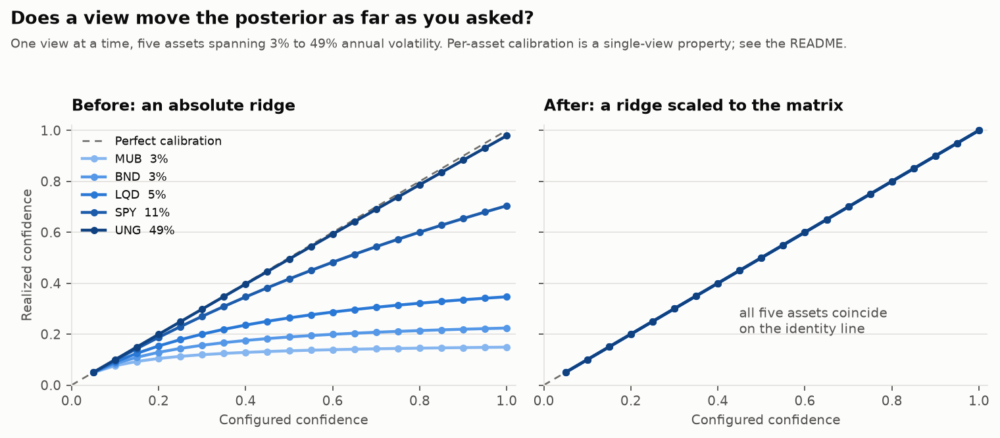

# portfolio-optimization-black-litterman

Black-Litterman case-study framework for evaluating publicly disclosed portfolios from notable figures.

## Project Question
Can a Black-Litterman overlay improve portfolio quality relative to:
1. The disclosed portfolio itself
2. A mean-variance (sample-estimated) baseline

## Implemented Capabilities
- Disclosure and price ingestion with schema validation and descriptive error messages.
- Latest disclosed portfolio reconstruction by person aliases.
- Rolling rebalancing backtest engine (lookback-based, no look-ahead application).
- Strategy comparison:
  - `disclosed` (static disclosed weights),
  - `mean_variance` (sample-estimated Markowitz),
  - `black_litterman` (equilibrium + views posterior; explicit pick-matrix views per case study).
- Metrics: annual return/volatility, Sharpe and Sortino (net of the one-month T-bill rate when
  factor data is configured), max drawdown, HHI concentration, turnover.
- CLI pipeline with structured logging (`--verbose` flag) that writes per-case outputs to `reports/output/<person>/`.
- Four notebooks with visual diagnostics, strategy comparison, sensitivity analysis, and benchmark attribution.
- Configurable `view_confidence` parameter exposed via YAML and `BacktestConfig`.
- Explicit absolute and relative views with per-view confidence, defined in YAML per case study.
- Fama-French factor-model performance attribution (CAPM, FF3, FF5) with Newey-West (HAC)
  standard errors, run per case study or across all three at once.

## Important Caveats
- Public disclosures are delayed, incomplete, and sometimes approximate.
- Disclosure quality is source-dependent; conclusions are only as good as the input coverage.
- This repo is for research only, not investment advice.

See [Assumptions and Limitations](#assumptions-and-limitations) for the modeling choices
that most affect how the results should be read.

## Known Model Limitation

The BL posterior assumes multivariate Gaussianity in both returns and views. Equity
return distributions exhibit significant excess kurtosis and left-tail asymmetry,
particularly during stress periods directly visible in this backtest — the 2020 COVID
drawdown and the 2022 rate shock. A production-grade system would replace the Gaussian
prior with Meucci's Entropy Pooling / Copula Opinion Pooling framework, which separates
the marginal distributions from the dependence structure and allows views to be expressed
on arbitrary statistics including implied volatility.

## Repository Layout
```text
portfolio-optimization-black-litterman/
  configs/                   # Case-study and backtest parameters (incl. view_confidence, views)
  docs/
    figures/                 # Plots embedded in this README (light + dark variants)
  data/
    raw/
      disclosures/           # Input holdings disclosures CSV
      prices/                # Input price history CSV
      factors/                # Bundled Fama-French factor CSVs (see its own README)
  notebooks/                 # Visual walkthrough notebooks
  reports/
    templates/               # Markdown report templates
    output/                  # Generated case-study artifacts
  scripts/
    make_figures.py          # Regenerates docs/figures/
    performance_tables.py    # Regenerates the README's Sharpe-bearing tables
    run_case_study.py        # CLI entrypoint
    factor_attribution.py    # Cross-case Fama-French factor-attribution report
    fetch_fama_french.py     # Refreshes data/raw/factors/ from Ken French's data library
  src/portfolio_bl/
    backtest/                # Rolling backtest, metrics, factor attribution
    data/                    # Disclosure, price and factor loaders
    models/                  # BL posterior, pick-matrix views, mean-variance logic
    pipeline.py              # End-to-end experiment runner
  tests/                     # Unit + integration tests (199 tests)
```

## Input Data Schemas
### Disclosures CSV
Required columns:
- `person`
- `as_of_date` (YYYY-MM-DD)
- `ticker`
- `value_usd`

Optional column:
- `source`

### Prices CSV
Required columns:
- `date` (YYYY-MM-DD)
- `ticker`
- `close`

### Factors CSV
Bundled under `data/raw/factors/` (`ff3_daily.csv`, `ff5_daily.csv`, `ff3_monthly.csv`); see
`data/raw/factors/README.md` for the full schema, source, and vintage. Required columns:
- `date` (`YYYY-MM-DD` daily, `YYYY-MM` monthly)
- `Mkt-RF`, `SMB`, `HML` (3-factor), plus `RMW`, `CMA` (5-factor)
- `RF`

Every value is published as a percent (`0.85` means `0.85%`); `load_factor_csv` is the only
place that converts it to decimal.

## Environment and Setup

Either route works. The conda route creates an isolated environment named `portfolio-bl`
from `environment.yml`; the pip route installs into an interpreter you already have.

```bash
# conda
conda env create -f environment.yml
conda activate portfolio-bl
python -m pip install -e '.[dev,notebooks]'

# or pip only, into an existing Python 3.10+ interpreter
python -m pip install -e '.[dev,notebooks]'
```

The editable install matters: `pyproject.toml` puts the package under `src/`, and both the
CLI and the notebooks import `portfolio_bl` by name.

**Nothing here is version-pinned.** `environment.yml` and `pyproject.toml` both specify only
lower bounds (`python>=3.10`, `numpy>=1.26`, `pandas>=2.1`), so a fresh solve tracks whatever
is current. The figures in this README were produced on Python 3.14.7 with NumPy 2.5.3 and
pandas 3.0.5. If you need byte-identical reproduction, pin your own versions; the repo will
not do it for you.

## Quick Start
```bash
cd portfolio-optimization-black-litterman
python -m pip install -e '.[dev,notebooks]'
pytest -q
python scripts/run_case_study.py --person buffett
python scripts/run_case_study.py --person pelosi
python scripts/run_case_study.py --person trump
```

Pass `--verbose` to enable debug-level logging:
```bash
python scripts/run_case_study.py --person buffett --verbose
```

Generated outputs include:
- `summary.csv`
- `equity_curve.csv`
- `strategy_returns.csv`
- `weights_<strategy>.csv`
- `metadata.csv`
- `factor_attribution.csv` (skipped if `data.factors_dir` is not configured; it is, in the
  shipped `configs/case_studies.yaml`)

All written under `reports/output/<person>/`.

Run the same factor regressions across all three case studies at once, and print the tables
under [Factor attribution](#factor-attribution) below, with:
```bash
python scripts/factor_attribution.py   # or: make attribution
```

## Selected Results

Every figure below comes from the bundled dataset and the shipped configuration (6-period
lookback, month-end rebalancing, `view_confidence: 0.65`). Every Sharpe ratio is net of the
one-month T-bill rate, which compounds to 2.6% a year over the backtest. Regenerate the tables
that quote a Sharpe ratio with `python scripts/performance_tables.py` (or `make tables`), the
per-case outputs with `python scripts/run_case_study.py --person <key>`, and the plots with
`python scripts/make_figures.py`.

### Dataset at a glance

| | |
|---|---:|
| Adjusted daily closes | 90,298 rows |
| Tickers | 46 |
| Price coverage | 2018-01-02 to 2025-12-30 (2,009 trading days) |
| Disclosure rows | 51 across 3 people |
| Backtest window | 2018-08-01 to 2025-12-30 (1,864 days after lookback warm-up) |

### The disclosed portfolios

| Person | Snapshot | Holdings | Largest position | HHI |
|---|---|---:|---|---:|
| Warren Buffett | 2025-12-31 | 14 | AXP at 24.6% | 0.136 |
| Nancy Pelosi | 2024-12-31 | 22 | AAPL at 28.1% | 0.145 |
| Donald Trump | 2024-12-31 | 15 | DJT at 91.0% | 0.828 |

Every disclosed ticker has price history, so no holding is dropped from any backtest.

<picture>
  <source media="(prefers-color-scheme: dark)" srcset="docs/figures/disclosed-concentration-dark.png">
  
</picture>

The Trump panel uses a different horizontal scale from the other two. The HHI figure in each
title is scale-free and comparable across all three.

### Strategy comparison

| Person | Strategy | Annual return | Annual vol | Sharpe | Max drawdown | Turnover |
|---|---|---:|---:|---:|---:|---:|
| Buffett | disclosed | 17.5% | 23.5% | 0.64 | -43.4% | 0.0% |
| Buffett | mean-variance | 10.6% | 21.4% | 0.37 | -34.9% | 36.2% |
| Buffett | Black-Litterman | 14.2% | 21.2% | 0.55 | -32.7% | 30.1% |
| Pelosi | disclosed | 27.9% | 27.6% | 0.92 | -38.9% | 0.0% |
| Pelosi | mean-variance | 22.6% | 25.1% | 0.80 | -36.7% | 32.1% |
| Pelosi | Black-Litterman | 23.2% | 25.1% | 0.82 | -37.3% | 29.2% |
| Trump | disclosed | 7.5% | 147.2% | 0.03 | -84.6% | 0.0% |
| Trump | mean-variance | 8.4% | 10.5% | 0.55 | -17.2% | 28.0% |
| Trump | Black-Litterman | 6.0% | 11.5% | 0.30 | -23.1% | 26.6% |
| *benchmark* | *SPY, same window* | *14.6%* | *19.7%* | *0.61* | *-33.7%* | *n/a* |

<picture>
  <source media="(prefers-color-scheme: dark)" srcset="docs/figures/equity-curves-dark.png">
  
</picture>


### Reading the table

- **The overlay does not beat the disclosed book for Buffett or Pelosi**, and the honest
  explanation is hindsight. A single snapshot dated 2025-12-31 (Buffett) or 2024-12-31 (the
  others) is held all the way back to 2018, so the names are selected by having survived to
  the snapshot date. Treat the `disclosed` column as an upper bound contaminated by
  look-ahead, not as a fair competitor.
- **Pelosi's disclosed book returned 27.9% a year against SPY's 14.6%**, with a comparable
  drawdown. The same hindsight caveat applies in full.
- **Trump's 147% volatility and -84.6% drawdown are one position.** DJT is 91% of that
  snapshot and did not trade until late 2021, so the curve sits flat near 1.0 and then
  inherits the ticker's swings almost directly. Both optimizers re-estimate weights from the
  lookback window and never take on that concentration, which is why mean-variance turns a
  0.03 Sharpe into 0.55.
- **Black-Litterman's Sharpe ratio lands between its two inputs' in every case**, which is what
  the model is built to do rather than a disappointment. It does not on every column: Trump's
  overlay compounds at 6.0% against 7.5% and 8.4%, and Buffett's has the lowest volatility and
  the shallowest drawdown of the three.

<picture>
  <source media="(prefers-color-scheme: dark)" srcset="docs/figures/drawdowns-dark.png">
  
</picture>


### Market exposure over time

Returns alone do not say whether a strategy earned its result or simply took more market risk.
A rolling 252-day beta against SPY shows how much market exposure each strategy carried, and
how that changed.

<picture>
  <source media="(prefers-color-scheme: dark)" srcset="docs/figures/rolling-beta-dark.png">
  
</picture>

Two betas are worth distinguishing. The median of the rolling series summarizes the figure. The
full-sample beta is measured over the same days as the return figures above, so it is the one to
use when attributing those returns.

| Person | Strategy | Median rolling beta | Full-sample beta |
|---|---|---:|---:|
| Buffett | disclosed | 0.95 | 1.07 |
| Buffett | mean-variance | 0.84 | 0.95 |
| Buffett | Black-Litterman | 0.79 | 0.91 |
| Pelosi | disclosed | 1.34 | 1.26 |
| Pelosi | mean-variance | 1.11 | 1.12 |
| Pelosi | Black-Litterman | 1.08 | 1.08 |
| Trump | disclosed | 0.81 | 0.62 |
| Trump | mean-variance | 0.42 | 0.43 |
| Trump | Black-Litterman | 0.35 | 0.36 |

- **Both overlays carry less market exposure than the disclosed book in every case**, on both
  measures. That is the clearest thing they demonstrably do.
- **Beta explains part of Pelosi's headline number, but not most of it.** That book returned
  27.9% a year against the market's 14.6%, a gap of 13.2 points. Its full-sample beta is 1.26,
  so market exposure accounts for `1.26 x 14.6% - 14.6%`, about 3.8 points. The remaining 9.5
  points is residual. The CAPM row under [Factor attribution](#factor-attribution) makes the same
  split on its own basis: arithmetic means, the CRSP market, and returns in excess of T-bills.
  There the book beat the market by 13.0 points a year, a beta of 1.22 accounts for 2.8 of them,
  and alpha is 10.2%. That alpha is larger than the 9.5-point residual because the basis changed:
  against SPY with no risk-free rate it is 8.8% (t-statistic near 2 with ordinary standard
  errors), 9.4% once the T-bill rate is subtracted, and 10.2% against the CRSP market. Beta
  explains 22% to 28% of the gap either way. The rest is what the hindsight caveat above is about,
  not skill established by this backtest.
- **The overlays are steadier**, though the headline contrast overstates it. Across the whole
  series Trump's disclosed beta spans 1.57 while Black-Litterman spans 0.60, but both numbers
  are inflated by the pre-2022 plateau described below. Restricting to windows that exclude it,
  the disclosed range is still 1.11 against 0.35 for Black-Litterman.

Three caveats specific to this figure. The Trump disclosed line sits near 0.08 until the price
series under DJT begins in September 2021 (as a SPAC; see
[Assumptions and Limitations](#assumptions-and-limitations)), which is not low market exposure
but the zero-fill described under
[Backtest Semantics](#backtest-semantics): 91% of that book is a ticker with no returns yet.
That plateau also drags the Trump row of the table, whose median is 1.08 rather than 0.81 once
those windows are dropped. And SPY is itself 1.36% of the Trump disclosed portfolio, so that one
line is very mildly regressed against itself; Buffett and Pelosi hold no SPY.

This figure stops short of a full factor attribution; see
[Factor attribution](#factor-attribution) below for one with proper style factors and
Newey-West standard errors. Notebook 4 also computes a decomposition, but its sector factors
fall back to proxies built from the portfolios' own holdings when an ETF is missing from the
price file, so its alpha there is not comparable across the three cases.

### Factor attribution

Beta captures market exposure; it says nothing about exposure to size, value, profitability or
investment style, and it carries no standard error. `scripts/factor_attribution.py` regresses
each strategy's daily excess return (return minus the derived daily risk-free rate) on CAPM
(market only), FF3 (`Mkt-RF`, `SMB`, `HML`) and FF5 (adds `RMW`, `CMA`) factors from Kenneth
French's data library, with an intercept and Newey-West (HAC) standard errors. The sample is the
full backtest window: 1,864 daily returns, 2018-08-01 to 2025-12-30, identical dates across all
nine strategy series and SPY. Alpha is the intercept annualized arithmetically (`x 252`).

| Person | Strategy | CAPM alpha | t | FF3 alpha | t | FF5 alpha | t |
|---|---|---|---|---|---|---|---|
| Warren Buffett | Disclosed | 3.2% | 0.9 | 2.5% | 1.0 | 2.6% | 1.0 |
| Warren Buffett | Mean-variance | -1.9% | -0.5 | -3.5% | -1.0 | -3.6% | -1.0 |
| Warren Buffett | Black-Litterman | 1.8% | 0.4 | 0.0% | 0.0 | -0.1% | 0.0 |
| Nancy Pelosi | Disclosed | 10.2% | 2.2 | 9.2% | 2.7 | 8.8% | 2.7 |
| Nancy Pelosi | Mean-variance | 7.0% | 1.6 | 6.4% | 1.6 | 6.9% | 1.8 |
| Nancy Pelosi | Black-Litterman | 7.9% | 1.7 | 7.3% | 1.7 | 7.8% | 1.8 |
| Donald Trump | Disclosed | 53.0% | 0.9 | 55.9% | 0.9 | 56.4% | 1.0 |
| Donald Trump | Mean-variance | 0.7% | 0.3 | 0.7% | 0.4 | 0.8% | 0.4 |
| Donald Trump | Black-Litterman | -0.5% | -0.1 | -0.6% | -0.2 | -0.2% | -0.1 |
| SPY (check) | | 0.7% | 1.1 | 0.0% | 0.1 | -0.2% | -0.5 |

FF5 loadings, with R² (FF3 loadings, and every t-statistic behind these three tables, are in
`reports/output/factor_attribution.csv`, or re-run `python scripts/factor_attribution.py`):

| Person | Strategy | Alpha (ann.) | t | Mkt | SMB | HML | RMW | CMA | R² |
|---|---|---|---|---|---|---|---|---|---|
| Warren Buffett | Disclosed | 2.6% | 1.0 | 1.08 | -0.11 | 0.51 | 0.00 | -0.01 | 0.90 |
| Warren Buffett | Mean-variance | -3.6% | -1.0 | 0.98 | -0.25 | 0.19 | 0.03 | 0.16 | 0.79 |
| Warren Buffett | Black-Litterman | -0.1% | 0.0 | 0.94 | -0.30 | 0.15 | 0.00 | 0.23 | 0.74 |
| Nancy Pelosi | Disclosed | 8.8% | 2.7 | 1.19 | -0.17 | -0.40 | 0.13 | -0.23 | 0.91 |
| Nancy Pelosi | Mean-variance | 6.9% | 1.8 | 1.06 | -0.14 | -0.12 | -0.11 | -0.23 | 0.82 |
| Nancy Pelosi | Black-Litterman | 7.8% | 1.8 | 1.03 | -0.17 | -0.14 | -0.13 | -0.24 | 0.79 |
| Donald Trump | Disclosed | 56.4% | 1.0 | 0.55 | 0.41 | -0.33 | -0.29 | 0.35 | 0.01 |
| Donald Trump | Mean-variance | 0.8% | 0.4 | 0.44 | 0.00 | 0.17 | -0.06 | 0.11 | 0.75 |
| Donald Trump | Black-Litterman | -0.2% | -0.1 | 0.36 | -0.07 | 0.08 | -0.19 | 0.17 | 0.41 |
| SPY (check) | | -0.2% | -0.5 | 0.98 | -0.09 | 0.01 | 0.06 | 0.05 | 1.00 |

n_obs=1,864, Newey-West lags=7 (`floor(4 x (1864/100)^(2/9))`), 2018-08-01 to 2025-12-30.

The last table regresses return *differences* on the same factors: each overlay minus the
disclosed book, and Black-Litterman minus mean-variance. A return difference is already a
zero-cost long-short excess return, so the risk-free rate is not subtracted again. Because all
nine series share the same 1,864 dates, its alpha equals the difference of the two alphas above
exactly; the regression adds the standard error.

| Person | Strategy | CAPM alpha | t | FF3 alpha | t | FF5 alpha | t |
|---|---|---|---|---|---|---|---|
| Warren Buffett | Mean-variance minus disclosed | -5.1% | -1.4 | -6.0% | -1.8 | -6.3% | -1.9 |
| Warren Buffett | Black-Litterman minus disclosed | -1.4% | -0.3 | -2.5% | -0.6 | -2.8% | -0.7 |
| Warren Buffett | Black-Litterman minus mean-variance | 3.7% | 2.3 | 3.5% | 2.2 | 3.5% | 2.2 |
| Nancy Pelosi | Mean-variance minus disclosed | -3.2% | -0.7 | -2.7% | -0.6 | -1.9% | -0.5 |
| Nancy Pelosi | Black-Litterman minus disclosed | -2.3% | -0.5 | -1.9% | -0.4 | -1.0% | -0.2 |
| Nancy Pelosi | Black-Litterman minus mean-variance | 0.9% | 0.7 | 0.9% | 0.7 | 0.9% | 0.7 |
| Donald Trump | Mean-variance minus disclosed | -52.4% | -0.9 | -55.2% | -0.9 | -55.5% | -0.9 |
| Donald Trump | Black-Litterman minus disclosed | -53.5% | -0.9 | -56.5% | -1.0 | -56.6% | -1.0 |
| Donald Trump | Black-Litterman minus mean-variance | -1.2% | -0.4 | -1.3% | -0.5 | -1.0% | -0.4 |

The two Trump rows against the disclosed book are driven by two trading days; see the Trump
bullet below.

### Reading the tables

- **The SPY validation row behaves as it should.** Market loading is 0.98 with R² of 0.99 (FF3)
  and 1.00 (FF5), and alpha is 0.0% under FF3 and -0.2% under FF5. Its CAPM alpha of 0.7% is a
  size effect, not a defect. Over this window small caps lagged the market by 5.6% a year after
  adjusting for beta (SMB's own CAPM alpha), and SPY's SMB loading of -0.12 turns that into about
  0.65 points that CAPM has no factor to absorb. Once SMB enters under FF3 the alpha disappears.
- **Pelosi's disclosed book keeps a positive alpha as style factors are added, and its
  t-statistic rises while the alpha falls** (10.2% at t 2.2 under CAPM, to 8.8% at t 2.7 under
  FF5), because the style factors absorb residual variance (R² climbs from 0.82 to 0.91) rather
  than because the alpha grows. The book carries a growth tilt (HML -0.40 under FF5, -0.47 under
  FF3), CMA -0.23 (loads on aggressively investing firms), and RMW +0.13. Do not read the
  t-statistic as evidence of skill. The book is a 2024-12-31 snapshot held back to 2018: its
  names are the ones still held after the run-up, and its weights are end-of-period values, so
  the names that rose most carry the most weight from the start. A book built that way is biased
  toward a positive alpha whether or not any skill is involved (an equal-weight book of the same
  names already has a lower FF5 alpha, 6.0% at t 2.1); a factor regression controls for style,
  not for how the names or weights were chosen. Two further checks are consistent with that,
  though neither can separate hindsight from skill. The alpha sits in the biggest winners, as it
  would under either reading: NVDA contributes 3.7 of the 8.8 points and AAPL 2.2, and dropping
  NVDA alone leaves 5.7% (t 1.7). And 2025, the only year in the window after the snapshot date,
  shows an FF5 alpha of 0.9% (t 0.1) against 10.2% (t 2.9) before it, but the 9.3-point gap has
  a standard error of about 8.4 points, so one year cannot tell the two apart. A multiple-testing correction does not settle it
  either way: 2.7 clears the Bonferroni bar of 2.64 for six tests (treating each person's nearly
  identical mean-variance and Black-Litterman rows as one), misses 2.77 for all nine rows, and
  misses 3.11 once all three models count.
- **Buffett's disclosed book carries a strong value tilt (the overlays a mild one), but size,
  not value, is what moves their alpha.** The disclosed book's HML loading is +0.49 (FF3) /
  +0.51 (FF5), against 0.15 to 0.19 for the overlays. Over this window,
  though, HML earned nothing beyond its own market exposure (a CAPM alpha of -0.06% a year), so
  the tilt moves alpha by less than 0.1 point. What CAPM misreads is size: the book and both
  overlays lean large-cap (SMB -0.14 to -0.33 under FF3), and small caps lagged by 5.6% a year
  after adjusting for beta, so CAPM counts that tilt as alpha. It accounts for the whole change
  from CAPM to FF3, including 3.2% to 2.5% for the disclosed book and 1.8% to 0.0% for
  Black-Litterman. Neither of those CAPM figures was distinguishable from zero to begin with (t
  0.9 and 0.4), and none of Buffett's nine strategy-level alpha estimates clears even the
  single-test threshold of 1.96.
- **Trump's disclosed-book alpha is two trading days, not a finding.** The 53-56% a year is an
  arithmetic mean, and two days supply almost all of it. On 2021-10-21 and 2021-10-22 the price
  series under `DJT` rose 357% and 107%, lifting the book 324% and 97%; those two days alone add
  57 points a year to the mean. Without them alpha is -3.7% (CAPM), -1.1% (FF3) and 0.4% (FF5),
  every |t| below 0.2, and the book compounds at -19.3% a year rather than the 7.5% it
  compounded with them. Those days are the merger
  announcement of the SPAC whose prices sit under `DJT` before March 2024 (see
  [Assumptions and Limitations](#assumptions-and-limitations)), not a return on the listed stake
  in the disclosure. The zero-fill also splits the sample in two. Before the series begins on
  2021-09-30, 91% of the book earns exactly zero while the regression charges the T-bill rate on
  all of it. That yields an alpha of -1.2% to -1.6% (t near -3), about 1.0 point of it the T-bill
  charge on the idle 91% and the rest the small remaining sleeve's own alpha, with a market
  loading of 0.07. Afterwards the loading is 1.1 to 1.25, so the full-sample 0.53-0.62 is
  a blend of two regimes rather than an exposure the book ever had. R² is 0.01 because DJT's own
  moves swamp everything after 2021-09-30 (0.01-0.02 over that period alone). The Trump book and
  overlays also hold bond, municipal-bond and natural-gas funds (`BND`, `LQD`, `MUB`, `VGIT`,
  `EMB`, `UNG`) that equity factors do not price, which is part of why even the overlays' R² of
  0.38-0.75 falls well short of SPY's.
- **Overlay minus disclosed, the first half of the project question, is "not distinguishable",
  but the test is weak.** For Buffett and Pelosi none of the twelve estimates is significant at
  the default seven lags. The largest |t| is 1.9 (Buffett mean-variance minus disclosed, FF5,
  -6.3%); at 21 lags (one rebalance month) it is 2.0 and just clears 1.96, so that one verdict is
  borderline rather than settled. With standard errors of 3.3 to 4.5 points a year under FF5, a
  difference would need to be 9 to 13 points a year to be detected four times in five; the FF5
  alpha differences actually estimated are 1.0 to 6.3 points (the compounded return gaps are 3.4
  to 7.0). This is absence of
  evidence, not evidence that the books perform alike. The consistent negative sign is weaker
  than twelve estimates suggest: the three models are nested fits of the same series, and within
  each person the two difference series correlate at 0.94 or more. Hindsight predicts that sign
  anyway, because the disclosed book is the hindsight-selected one. The Trump rows carry no
  information in either direction: they are the two SPAC days above with the sign reversed.
  Mean-variance compounded 0.8 points a year faster than the disclosed Trump book, and without
  those two days its CAPM difference is +4.4%. All of these differences are gross of trading
  costs, which would widen every gap in the disclosed book's favor.
- **Black-Litterman minus mean-variance, the second half of the project question, is the only
  difference that clears 1.96 at the default seven lags** (at 21 lags Buffett's mean-variance
  minus disclosed, FF5, reaches -2.0 as well). For Buffett it is +3.7% (CAPM, t 2.3), +3.5% (FF3,
  t 2.2) and +3.5% (FF5, t 2.2). For Pelosi it is +0.9% (t 0.7), and for Trump -1.0% to -1.3% (t
  -0.4 to -0.5). At seven lags the Buffett result does not survive a Bonferroni correction across
  the three case studies (|t| above 2.39); at 15, 21, 42 and 63 lags the CAPM row does (2.42 to
  2.46), but no model's row reaches the 2.77 bar for all nine difference rows at any of those
  lags. Little of the lead comes from the hindsight-selected prior. Rerunning Black-Litterman with an equal-weight prior, or
  with a zero prior, leaves Buffett's difference at +3.3% to +3.5% (t 2.1 to 2.2), and the
  Black-Litterman weights sit about as far from the disclosed book as mean-variance's do (mean
  distance 0.42 against 0.43). The lead comes from the posterior itself, which shrinks the
  six-month sample means toward a prior before optimizing, on a universe that both methods share
  and that hindsight chose. It is also one case of three: averaged across all three case studies
  the difference is +1.1% a year (FF5, t 0.9).

### View confidence interpolates between the two baselines

Because the equilibrium prior is implied from the disclosed weights, confidence sweeps the
posterior from one baseline to the other. Distances are the mean L2 norm between weight
vectors across rebalances (Buffett, real data).

| Confidence | Distance to disclosed | Distance to mean-variance | Sharpe | Turnover |
|---:|---:|---:|---:|---:|
| 0.01 | 0.063 | 0.390 | 0.64 | 5.9% |
| 0.20 | 0.351 | 0.243 | 0.60 | 24.9% |
| 0.40 | 0.400 | 0.209 | 0.59 | 27.7% |
| 0.65 | 0.420 | 0.165 | 0.55 | 30.1% |
| 0.80 | 0.423 | 0.126 | 0.50 | 31.7% |
| 0.95 | 0.425 | 0.054 | 0.42 | 34.5% |
| 0.999 | 0.429 | 0.002 | 0.37 | 36.2% |

Three things worth noting. Sharpe falls monotonically as confidence rises, so on this data
trusting the trailing sample means more is actively harmful, and turnover rises with it.
The blend reaches its endpoints cleanly: at confidence 0.999 the distance to the
mean-variance portfolio is 0.002, so a fully trusted view really does recover that
portfolio. And the Black-Litterman strategy is best understood as a tunable blend of the
other two rather than an independent third model.

<picture>
  <source media="(prefers-color-scheme: dark)" srcset="docs/figures/confidence-sweep-dark.png">
  
</picture>


> **The confidence axis is calibrated for a single view.** Earlier versions added a fixed absolute `1e-6` to
> the view-uncertainty matrix. That matrix holds per-period variances: across all 270
> estimation windows an absolute view's entry spans `5e-8` to `7e-4`, and a relative view
> between two similar bond funds goes lower still, down to `1.9e-8` for BND against VGIT.
> The fixed constant therefore ranged from negligible at the top of that range to 51 times
> the quantity it was meant to stabilize at the bottom, and the confidence a user configured
> was not the one they got: a configured 0.65 realized as 0.14 for MUB and 0.64 for UNG. The
> regularization is now proportional to each asset's own variance, so a single absolute view
> realizes its configured value for every asset to within `2e-6`, and exactly when the ridge
> is disabled. A single *relative* view between two highly correlated assets is looser, since
> `Omega` is derived from the unregularized covariance while the posterior uses the
> regularized one: the error grows roughly as `ridge / (1 - rho)`, reaching `2e-5` at a
> correlation of 0.99. The sweep above stacks one view per asset, where per-asset
> calibration does not hold and `c` acts as a dial on the set of views rather than a per-asset
> guarantee; see [Methodology](#methodology). The figures above are post-fix; the correction
> moved the Trump mean-variance Sharpe from 0.85 to 0.80 (both then computed at a zero
> risk-free rate), that case study having the worst-conditioned covariance.

<picture>
  <source media="(prefers-color-scheme: dark)" srcset="docs/figures/confidence-calibration-dark.png">
  
</picture>


## Methodology

What the three strategies actually compute. All of it lives in `src/portfolio_bl/models/`
and `src/portfolio_bl/pipeline.py`.

### The estimation window

Every model quantity comes from one rolling window of daily arithmetic returns.

- Returns are `pct_change()` on the pivoted adjusted-close matrix, so `mu`, `Sigma`, `pi`
  and `q` are all in **daily** units. Nothing is annualized before the optimizer;
  annualization happens only in the metrics layer.
- Rebalance dates are the last trading day of each month (`rebalance_frequency: ME`).
- `lookback_periods: 6` counts **rebalance intervals, not rows**. The training slice runs
  from the month-end six rebalances earlier up to, but excluding, the current one, which is
  122 to 129 trading days on the bundled data.
- The first six month-ends are warm-up, leaving **90 rebalances** per case study.
- `estimate_mean_cov` takes the plain sample mean and sample covariance of that slice. No
  shrinkage, no exponential weighting, no factor structure.
- Any ticker with even one missing return inside the window is dropped from that window and
  carries zero weight there. On the bundled data this affects two case studies: Trump loses
  DJT from 45 of 90 windows, and Pelosi loses RBLX from 38, CRWD from 17 and DBX from 2.

### `disclosed`

Weights are `value_usd / value_usd.sum()` at the person's latest `as_of_date`, restricted to
tickers that also have price history, then renormalized. The same vector is returned at
every rebalance.

### `mean_variance`

`mu` and `Sigma` from the window, passed straight to `long_only_markowitz_weights`. The
`risk_aversion` setting is never read on this path.

### `black_litterman`

**1. The equilibrium prior.** `implied_equilibrium_returns` computes

```
pi = lambda * Sigma * w_mkt
```

where `lambda` is `backtest.risk_aversion` and `w_mkt` is **the disclosed portfolio weights,
renormalized over the tickers with data in this window**, not true market-capitalization
weights. This is the single most consequential modeling choice in the repo. Textbook
Black-Litterman asks what returns would make *the market* efficient; this asks what returns
would make *this person's book* efficient. The prior is therefore the disclosed portfolio
itself, and the posterior blends the disclosed book with the views rather than the market
with the views.

The direct consequence is that **with no views the model returns the disclosed portfolio.**
The posterior collapses to `mu_BL = pi` and `Sigma_BL = (1 + tau) * Sigma`, and the solver's
unconstrained step is then proportional to `w_mkt`, which survives renormalization.

**2. The posterior.** `black_litterman_posterior` implements

```
M        = inv(tau * Sigma) + P' * inv(Omega) * P
mu_BL    = inv(M) * ( inv(tau * Sigma) * pi  +  P' * inv(Omega) * q )
Sigma_BL = Sigma + inv(M)
```

- `Sigma` (n x n): window sample covariance, plus a relative ridge (see below).
- `P` (k x n): the pick matrix, one row per view.
- `q` (k,): the per-period return each view asserts for its row of `P`.
- `Omega` (k x k): view uncertainty. Larger entries mean a less trusted view.
- `tau` (`0.05`): scales the prior mean's uncertainty as `tau * Sigma`.

Inverses are `np.linalg.pinv`, not `solve`. `mu_BL` is a precision-weighted average of `pi`
and `q`. `Sigma_BL` is always larger than `Sigma`, because parameter uncertainty is added to
the risk estimate rather than subtracted from it.

**3. `Omega` from a confidence scalar.** Instead of asking for a covariance,
`diagonal_omega_from_confidence` derives one from a confidence `c` in `(0, 1]`:

```
Omega = diag( diag( P (tau * Sigma) P' ) * (1 - c) / c )
```

Each view's uncertainty is its own prior variance under the model, scaled by `(1-c)/c`. At
`c = 0.5` that factor is exactly 1. As `c` approaches 1, `Omega` goes to zero; as `c`
approaches 0, the view is ignored. `Omega` is diagonal by construction, so view errors are
assumed independent even when two views overlap on the same asset.

**What `c` does and does not promise.** Each view realizes exactly the fraction `c` when
`P(tau*Sigma)P'` is diagonal *with strictly positive entries*, that is when the views'
projections are uncorrelated under the prior and each one carries some prior variance of its
own. `Omega` is diagonal by construction, so that is precisely the condition under which it
can match the prior term view by view. Two cases satisfy it: a *single* view, where the
posterior moves exactly `c` of the way regardless of the asset's volatility, so a lone view
set to 0.65 lands 65% of the way there whether it names a municipal bond fund or a meme
stock; and the identity block of sample-mean views over a diagonal `Sigma`.

It does **not** hold in the shipped default, where `use_sample_mean_views: true` stacks one
view per asset over a correlated `Sigma`. Measured on the last Buffett estimation window at a
configured 0.65, the per-asset fraction runs from -0.23 to 3.48: some assets overshoot their
view several times over, and others move away from it because a correlated neighbor's view
outweighs it. Nor does a diagonal `Sigma` rescue it once two pick rows touch the same asset,
which is what happens as soon as you add an explicit view on a ticker the sample-mean block
already covers. With `Sigma = diag(4e-4, 4e-4, 9e-4)` and one relative row stacked under the
identity block, the realized fractions are 0.79, 0.79, 0.65 and 0.79 against a configured 0.65.

This is ordinary Bayesian updating with correlated evidence rather than a defect: the
posterior is pooling what the views jointly say. But it does mean "0.65 means 65% of the way
for this asset" is the wrong mental model outside the two cases above. Read `c` there as a
dial on how much the views as a set move the posterior. Idzorek's method, which solves for
the `Omega` that achieves a target tilt, is the standard way to recover a per-view
interpretation under stacking; it is not implemented here.

Two edge cases sit outside the guarantee and are handled explicitly rather than silently.

- **A view with no prior variance of its own.** If `diag(P(tau*Sigma)P')` is zero for some
  view, that view has no scale from which to derive its uncertainty. This happens for an
  absolute view on a constant-price series such as a money-market fund, or a relative view
  between two perfectly correlated ones. The entry is replaced with the mean of the usable
  projected variances, or with `tau` times the mean prior variance when no view is usable,
  and a warning is logged. The substitute carries the data's units, so the weights stay
  invariant to return frequency.

  Such a view does **not** realize its configured `c`, and it is also **not** ignored, which
  is the trap. The posterior *mean* moves only `ridge * c/(1-c)` of the way toward it, so
  inspecting the mean suggests the view did nothing. But the asset's posterior *variance* is
  ridge-sized too, and a mean-variance optimizer takes the ratio, so the two cancel and `c`
  stays a powerful dial on the allocation. On a three-asset example the zero-variance asset
  goes from a weight of 0.00 with no view to 0.83 at `c = 0.5` and 1.00 at `c = 1`. That is
  defensible rather than broken: a zero-variance asset is risk-free, and asserting a positive
  return for it should pull the portfolio in. But read the weights, not the posterior mean.
  No window in the bundled data reaches this path, where the smallest projected variance is
  `1.9e-8`.
- **Confidence below `1e-3`.** `c` is clipped to `[1e-3, 1.0]` before `Omega` is built, so a
  programmatic caller passing a smaller positive value gets `1e-3` rather than an error, and
  the posterior still moves a little toward that view. The YAML path never reaches the clip:
  a `View` rejects any confidence outside `(0, 1]` outright.

**4. The default views are the trailing sample means.** With `use_sample_mean_views: true`
the pipeline stacks one absolute view per asset:

```
P = I (n x n)     q = mu, the lookback sample mean per asset     c = view_confidence
```

Out of the box the "analyst view" is simply the last six months of realized average return,
asserted asset by asset. That is why the strategy behaves as a tunable blend of `disclosed`
(the prior) and `mean_variance` (the views), and why raising confidence on this data hurts:
it means trusting a six-month trailing mean more. Explicit YAML views are appended as extra
rows below the identity block.

### Two parameters that do less than they appear to

**`risk_aversion` does not affect the final weights.** `long_only_markowitz_weights`
renormalizes to sum 1, and any positive rescaling of expected returns cancels in that step.
Multiplying `mu` by 0.5, 2.5 or 10 returns bit-identical weights. `lambda` scales `pi`, so
it too washes out.

**`tau` cancels out of the posterior mean entirely.** Because `Omega` is derived from the
same `tau * Sigma`, `tau` appears on both sides and drops out: `mu_BL` is identical to machine
precision for `tau = 0.005` and `tau = 5`. Since the regularization became relative this holds
with the ridge active, because the ridge on `Omega` is scaled by a quantity that carries `tau`
too. `tau` reaches the weights only through `Sigma_BL = Sigma + inv(M)`. End to end on the
Buffett case, moving `tau` from 0.05 to 0.5 shifts individual weights by at most 0.044, and to
5.0 by at most 0.448.
Treat `tau` as a knob on the posterior covariance, not on how strongly views are applied.
Use `view_confidence` for that.

### The long-only step is a projection, not a constrained optimum

Both optimizers finish in `long_only_markowitz_weights`:

```python
cov_reg = cov + np.diag(relative_ridge(cov, ridge))
raw = np.linalg.solve(cov_reg, mu)   # unconstrained: w proportional to inv(Sigma) mu
raw = np.clip(raw, 0.0, None)        # shorts clipped to zero
weights = raw / raw.sum()            # renormalize to sum 1
```

The system is solved with **no sign constraint and no budget constraint**. Negative entries
are then clipped and the survivors rescaled. That is a heuristic projection onto the
long-only simplex, not a solution of the constrained problem, and the two are not the same.
On a four-asset test case the projection returns a spread portfolio with mean-variance
utility 0.0626 where the true constrained optimum is a corner solution worth 0.0800. Read
the weights as "a long-only portfolio derived from the unconstrained solution", not as "the
optimal long-only portfolio".

An equal-weight fallback fires if the clipped weights sum to zero or less. It never triggers
on the bundled data across all 270 strategy-rebalances.

### Regularization is relative, not absolute

Three places add a ridge to a covariance-like matrix to keep it invertible: `Sigma` and
`Omega` inside the posterior, and the covariance inside the long-only solve. In each the
`ridge` argument is a **dimensionless fraction**, and the amount added to a diagonal entry is
that fraction of the entry itself:

```python
cov_reg = cov + np.diag(relative_ridge(cov, ridge))   # ridge defaults to 1e-6
```

This matters for two reasons. An absolute constant means something different for daily
returns, whose variances sit near `1e-4`, than for monthly or annual ones, so it silently
changes the model's behavior with the data frequency; scaling each entry by its own variance
makes the weights invariant to that choice. And within one universe, variances can span
orders of magnitude, so a single matrix-wide constant is negligible for a volatile equity and
dominant for a bond fund. Scaling per entry keeps the perturbation proportionate. An entry
whose variance is zero or not finite falls back to the mean of *all* the absolute diagonal
entries, zeros included, so an exactly singular covariance is still regularized. When that
mean is itself unusable, which happens for an all-zero diagonal and whenever any entry is NaN
or infinite, the helper falls back to an absolute `ridge`. Those are the only cases where the
old behavior is retained.

### Factor attribution

`scripts/factor_attribution.py` and `src/portfolio_bl/backtest/attribution.py` implement a
separate, standard factor-model regression; it does not touch the three strategies above.

Each strategy's daily return is regressed with an intercept:

```
r_t - rf_t = alpha + b_1 f_1t + ... + b_k f_kt + e_t
```

where `f_jt` are factor returns (CAPM: `Mkt-RF`; FF3 adds `SMB`, `HML`; FF5 adds `RMW`, `CMA`,
from Kenneth French's data library) and `rf_t` is the daily risk-free rate. `alpha_annual = alpha
* 252`, an arithmetic (not compounded) annualization.

Standard errors are Newey-West (1987) HAC with a Bartlett kernel:

```
V = (X'X)^-1 S (X'X)^-1
S = sum_t u_t^2 x_t x_t'  +  sum_{l=1}^{L} w_l * sum_t u_t u_{t-l} (x_t x_{t-l}' + x_{t-l} x_t')
w_l = 1 - l / (L + 1)
```

with lag count `L = floor(4 * (T/100)^(2/9))` (7 at the backtest's `T = 1,864`), and no
small-sample correction.

`rf_t` is derived from the monthly T-bill rate rather than the published daily rate, which is
rounded to 0.01% a day; see `data/raw/factors/README.md` for the size of that effect. The
difference rows (each overlay minus the disclosed book, and Black-Litterman minus mean-variance)
regress a return *difference* without subtracting `rf_t`, since the difference between two fully
invested portfolios' returns is already a zero-cost excess return. Because the script restricts
every series to the same dates, the alpha of a difference equals the difference of the two
alphas exactly.

## Backtest Semantics

The behavior of `src/portfolio_bl/backtest/engine.py` and `metrics.py`. Figures are for the
shipped configuration on the bundled data.

### The walk-forward loop

At each eligible rebalance date the engine slices the preceding lookback window, calls the
strategy's weight function, and holds the result until the next rebalance. Rebalance dates
that do not appear in the return index are dropped silently. A date is eligible once six
rebalance dates precede it, which is why each case study yields 90 rebalances rather than 96.

### No look-ahead

Weights computed at a rebalance date are applied **from the next trading day**, never to the
decision bar itself. The training slice also excludes the decision bar. A strategy can
therefore never trade on the return it is about to earn. This is why the reported backtest
begins on 2018-08-01 rather than at the first price date of 2018-01-02: the first six
month-ends are consumed as warm-up.

One consequence worth knowing: `weight_history` is indexed by the **decision** date, not by
the date the weights took effect.

### Between rebalances the book is re-set every day

The engine computes each day's portfolio return as `w . r_t` using the same `w` until the
next rebalance. That is a constant-mix portfolio rebalanced back to target **every trading
day**, not a buy-and-hold of those weights. Drift is never allowed to accumulate. The
difference is material where one position dominates:

| Person | `disclosed` as run (daily constant mix) | Same weights, bought and held |
|---|---:|---:|
| Buffett | 17.5% return, 0.64 Sharpe | 17.3%, 0.63 |
| Pelosi | 27.9%, 0.92 | 31.1%, 0.96 |
| Trump | 7.5%, 0.03 | 3.7%, 0.01 |

Trump is the instructive case: re-setting daily keeps buying back into DJT as it falls,
which flatters the return by 3.8 points a year against simply holding.

Turnover is computed from `weight_history`, which only records rebalance dates, so these
daily re-weighting trades are invisible to it. The `disclosed` strategy's 0.0% turnover
means "the target weights never change", not "no trading occurs".

### Missing data

Two different mechanisms handle gaps, and they interact:

- **In estimation**, any column with a NaN anywhere in the window is dropped, so the ticker
  gets zero weight that period.
- **In the return accumulation**, a missing return is filled with `0.0`.

A ticker that has not listed yet therefore behaves like uncompensated cash: it neither gains
nor loses, but it still occupies its share of the portfolio. For the Trump case study, DJT
is 91% of the disclosed book and does not trade until 2021-09-30, so the `disclosed` curve
sits nearly flat for years before inheriting the ticker's swings. The optimizers cannot hold
DJT until the 2022-04-29 rebalance, the first with a complete lookback window.

### Metrics

- `periods_per_year` is inferred from the median gap between dates, resolving to 252 here.
- Annualized return is **geometric**; annualized volatility is the sample standard deviation
  scaled by the square root of `periods_per_year`.
- Sharpe and Sortino are **net of the risk-free rate**: the numerator is the geometric
  annualized return minus the geometric annualized one-month T-bill return over the same days,
  taken from the bundled Fama-French data when `data.factors_dir` is configured and zero
  otherwise. This is not the textbook Sharpe ratio, which divides the arithmetic mean daily
  excess return by its own standard deviation. That version is 0.02 to 0.08 higher for every
  strategy and SPY except Trump's disclosed book, where it is 0.41 against 0.03 because an
  arithmetic mean carries no volatility drag at 147% volatility; almost all of that book's
  arithmetic return comes from two days (see [Factor attribution](#factor-attribution)).
  The denominators are unchanged: the volatility of raw returns, and for Sortino the spread of
  returns below zero, not below the T-bill rate. Sortino's hurdle and its downside threshold are
  therefore different targets where the textbook ratio uses one; moving the threshold to the
  T-bill rate adds 2 to 25 days to each strategy's downside set and changes no Sortino ratio here
  by more than 0.01.
- Sortino returns NaN rather than infinity when a series has no negative returns, which keeps
  CSV output well defined.
- HHI is the sum of squared weights, averaged over rebalances. `1/n` is equal weight, `1.0`
  is a single position.
- Turnover is half the sum of absolute weight changes between consecutive rebalances,
  averaged. It is **measured but never charged**: no transaction costs enter the returns.

## Assumptions and Limitations

Beyond the caveats above, these are the choices most likely to mislead a reader of the
results. Each was verified against the bundled data.

**The disclosed benchmark is selected by hindsight.** One snapshot is held across the whole
backtest: Buffett's is dated 2025-12-31 and the other two 2024-12-31, against a window that
opens in August 2018. The constituents are therefore known to have survived to the snapshot
date, and positions closed earlier never appear. The `disclosed` column is an upper bound
contaminated by look-ahead, not a fair competitor. The same selection flows into the other
two strategies, which optimize within that same surviving universe.

**Nothing is charged for trading.** No transaction costs, slippage, taxes, borrow or
financing appear anywhere. Charging a plausible cost against measured turnover at each
rebalance gives:

| Case | Strategy | 0 bp | 10 bp | 25 bp | 50 bp |
|---|---|---:|---:|---:|---:|
| Buffett | mean-variance | 0.37 | 0.35 | 0.32 | 0.26 |
| Buffett | Black-Litterman | 0.55 | 0.53 | 0.50 | 0.45 |
| Pelosi | Black-Litterman | 0.82 | 0.81 | 0.78 | 0.74 |
| Trump | mean-variance | 0.55 | 0.52 | 0.46 | 0.38 |

Costs move every comparison in the static book's favor, because the overlays turn over 26
to 37 percent a month while the disclosed book reports zero. They do not overturn the
ordering within any case study.

**The prior is the book, not the market.** As described under Methodology, `pi` is implied
from the disclosed weights. These are not market equilibrium returns in the Black-Litterman
sense, and they should not be read as such.

**The covariance estimate is thin.** Each window holds about 126 daily rows against a
covariance with `n(n+1)/2` free parameters:

| Case | Assets | Rows per parameter | Median condition number |
|---|---:|---:|---:|
| Buffett | 14 | 1.20 | 89 |
| Pelosi | 22 | 0.50 | 145 |
| Trump | 15 | 1.05 | 15,329 |

Pelosi's estimate is under-determined outright, and Trump's is badly conditioned because a
highly volatile single name sits alongside bond funds. Shrinking a noisy sample estimate
toward a structured prior is exactly the problem Black-Litterman exists to address, which
makes these ratios context for the results rather than a reason to discard them.

**Disclosed values are range tiers, not exact holdings.** House and OGE filings report bands,
and the loader uses midpoints. The one exception matters: DJT is reported as "over $50M" and
enters at the lower bound of $50,000,000. Its 91% weight in the Trump book is therefore an
artifact of that convention as much as a fact about the portfolio, and every Trump figure
inherits that choice.

**The price series under DJT before March 2024 is a SPAC's.** From 2021-09-30 until the merger
in March 2024, the bundled `DJT` prices are those of Digital World Acquisition Corp (DWAC), the
special-purpose acquisition company that merged with Trump Media & Technology Group. The
disclosed stake is in the merged company, so every Trump figure covering that period applies the
SPAC's price path to it. That path includes the merger-announcement spike of 2021-10-21 and
2021-10-22, which alone lifts the disclosed book 324% and 97% and dominates the Trump
disclosed-book alphas and both Trump overlay-minus-disclosed rows under
[Factor attribution](#factor-attribution). Neither overlay could hold DJT until 2022.

**Sharpe and Sortino are net of the T-bill rate, which is not small here.** The one-month
T-bill compounds to 2.6% a year over the backtest, so every Sharpe ratio is lower than it would
be at a zero rate by 2.6% divided by the strategy's volatility: 0.02 for the 147%-volatility
Trump book, 0.25 and 0.23 for the Trump mean-variance and Black-Litterman overlays (10.5% and
11.5% volatility), and 0.09 to 0.13 for every other strategy and SPY. With the geometric
numerator used here, the ordering within each case study is the same at either rate, in the
headline table and at every cost level in the table above. Two things do change. Trump's
mean-variance overlay falls from ahead of SPY (0.80 against 0.74) to behind it (0.55 against
0.61). And the invariance depends on the convention: with the textbook Sharpe ratio, charging
the T-bill moves Trump's Black-Litterman overlay from ahead of the disclosed book (0.56 against
0.43) to behind it (0.34 against 0.41), because that book's two SPAC days inflate its arithmetic
mean. The zero-rate figures are available with `python scripts/performance_tables.py --zero-rf`.
Removing `data.factors_dir` from the config also gives them, but it switches off factor
attribution too.

**Statistical significance is computed only for the factor attribution, plus one quoted
t-statistic.** The regressions under [Factor attribution](#factor-attribution) carry Newey-West
standard errors and t-statistics, and the Pelosi bullet under
[Market exposure over time](#market-exposure-over-time) quotes an ordinary t-statistic from a
single SPY regression. Nothing else in this README does: the headline performance table, the
Sharpe and Sortino comparisons, the confidence sweep, and the transaction-cost table above all
carry no standard errors, no bootstrap, and no significance test. With 90 rebalances on a single historical path
and three portfolios, differences of a few hundredths of a Sharpe point should not be read as
evidence that one method beats another.

**`prices.csv` is a snapshot.** The refresh script in `data/raw/prices/README.md` passes no
end date, so re-running it extends coverage to the current day and changes the backtest
window, the rebalance dates and every figure in this README.

**Estimation noise is not the only thing the ridge used to hide.** Regularization is now
proportional to each matrix's own scale, so the realized view confidence equals the
configured one and results no longer depend on whether returns are expressed daily or
monthly. See the note under [Selected Results](#selected-results) for what changed.

## Configuration

All backtest and model hyper-parameters live in `configs/case_studies.yaml`:

```yaml
backtest:
  lookback_periods: 6        # Historical periods used for estimation
  rebalance_frequency: ME    # Month-end rebalancing
  risk_aversion: 2.5         # λ in π = λΣw_mkt
  tau: 0.05                  # Prior uncertainty scalar
  view_confidence: 0.65      # BL analyst confidence (0, 1]; clipped below at 1e-3
  use_sample_mean_views: true  # stack explicit views on the sample-mean views
```

`view_confidence` controls how strongly the analyst's sample-mean views override the
Black-Litterman equilibrium prior. Higher values reduce view uncertainty (Ω) and pull
the posterior mean toward the views. It can also be overridden programmatically:

```python
from portfolio_bl.config import load_config
from portfolio_bl.pipeline import run_case_study

cfg = load_config("configs/case_studies.yaml")
result = run_case_study(cfg, person_key="buffett", view_confidence=0.80)
```

The optional `data.factors_dir` key points to the directory of bundled Fama-French factor CSVs
(`data/raw/factors` in the shipped config). When it is set, `run_case_study.py` also writes a
per-case `factor_attribution.csv`, `scripts/factor_attribution.py` can run, and Sharpe and
Sortino are charged the T-bill rate from the same files. When it is absent, `run_case_study.py`
skips factor attribution silently, Sharpe and Sortino fall back to a zero risk-free rate, and the
standalone attribution script raises an error. If the price data runs past the factor files'
last month, which is normal after a refresh because French publishes with a lag, the missing
days take the nearest available rate (and any days before the files begin take the first one).
`run_case_study.py` and `performance_tables.py` log a warning with the count; `make_figures.py`
switches logging off, so run one of the other two first after a refresh. Nothing caps the gap:
a couple of missing months moves the annualized rate by well under 0.01 point, but three
missing years would move it by about 0.3 points.

## Expressing Views with a Pick Matrix

The Black-Litterman strategy accepts explicit analyst views per case study. Each view is
one row of the pick matrix `P` with its target return in `q`. Views live under the case
study in `configs/case_studies.yaml`:

```yaml
case_studies:
  buffett:
    person_label: Warren Buffett
    disclosure_aliases: ["buffett", "warren buffett", "berkshire hathaway"]
    views:
      - label: AAPL absolute
        assets: {AAPL: 1.0}            # absolute view: one ticker, coefficient 1
        annual_return: 0.08            # AAPL returns 8% per year
        confidence: 0.6                # optional; overrides backtest.view_confidence
      - label: CVX over OXY
        assets: {CVX: 1.0, OXY: -1.0}  # relative view: long side +1, short side -1
        annual_return: 0.02            # CVX beats OXY by 2% per year
```

Rules and behavior:

- `assets` maps tickers to pick-matrix coefficients. An absolute view has one ticker with
  coefficient 1. A relative view has positive coefficients on the outperformers and negative
  coefficients on the underperformers; by convention each side sums to 1 in absolute value.
- `annual_return` is an annualized arithmetic return. It is divided by the number of return
  periods per year (252 for daily data) so it matches the scale of the covariance matrix.
- `confidence` is optional and per view, in `(0, 1]`. Views without it use
  `backtest.view_confidence`, as does the `view_confidence` override of `run_case_study`.
- By default (`use_sample_mean_views: true`) explicit views are stacked on top of the
  built-in sample-mean views, so the existing case studies are unchanged when no views are
  configured. Set `use_sample_mean_views: false` to optimize on explicit views alone. With
  that flag off and no views, the posterior equals the prior and the Black-Litterman
  weights track the disclosed portfolio.
- A view that references a ticker outside the case study's universe is ignored with a
  warning. A view naming a ticker without a *complete* lookback window of returns (a
  recently listed name) is not applied while that is true: the estimator drops any ticker
  with missing history from the window, so the ticker also carries zero Black-Litterman
  weight there. Both resume once the ticker has `lookback_periods` full periods of history,
  which is later than its first traded day.

Programmatic use:

```python
from portfolio_bl.models.views import View, build_view_matrices

views = [
    View({"AAPL": 1.0}, annual_return=0.08, confidence=0.6),
    View({"CVX": 1.0, "OXY": -1.0}, annual_return=0.02),
]
built = build_view_matrices(views, tickers, periods_per_year=252, default_confidence=0.65)
built.p_matrix, built.q_views, built.confidences  # P (k×n), q (k,), confidence per view (k,)
```

## Data Source Snapshot
- Buffett holdings come from Berkshire Hathaway's latest SEC 13F filing (as of `2025-12-31`) with a major-position ticker-mapped subset in this starter dataset.
- Pelosi holdings come from U.S. House financial disclosure report `10066169` (range-based values converted to midpoints).
- Trump holdings come from OGE 278e annual disclosure (range-based values converted to midpoints/lower bounds).
- Bundled `prices.csv` contains real adjusted daily closes sourced from Yahoo Finance (2018–2025); see `data/raw/prices/README.md` for the refresh script.
- Bundled factor files (`data/raw/factors/`) come from Kenneth French's data library (CRSP vintage 202607); see `data/raw/factors/README.md` for the refresh script and source hashes.

## Notebooks

Launch Jupyter with:
```bash
jupyter notebook
```

| # | Notebook | Description |
|---|----------|-------------|
| 1 | [Data Quality & Universe Overview](notebooks/01_data_quality_and_universe_overview.ipynb) | Schema checks, holdings coverage, portfolio composition |
| 2 | [Strategy Comparison Case Study](notebooks/02_strategy_comparison_case_study.ipynb) | Equity curves, drawdowns, BL weight evolution |
| 3 | [Black-Litterman Sensitivity](notebooks/03_black_litterman_sensitivity.ipynb) | View-confidence sweep and metric response |
| 4 | [Benchmark Attribution & Alpha Decomposition](notebooks/04_benchmark_attribution_alpha_decomposition.ipynb) | Benchmark betas, alpha decomposition, rolling alpha/beta |

Note: Notebook 4 uses ETF benchmarks when present (e.g. `SPY`, `XLK`, `XLE`, `XLF`) and falls back to transparent ticker proxies when benchmark tickers are missing. Its attribution is descriptive rather than a significance-tested regression, and because the proxy substitution differs by case study, its alpha is not comparable across the three; see [Factor attribution](#factor-attribution) for the reference estimate.

## Data Status

Both input datasets now use real data.

| Dataset | Source | Coverage |
|---|---|---|
| `data/raw/disclosures/disclosures.csv` | SEC 13F, House FD, OGE 278e (public filings) | Buffett (2025-12-31), Pelosi (2024-12-31), Trump (2024-12-31) |
| `data/raw/prices/prices.csv` | Yahoo Finance via yfinance (`auto_adjust=True`) | 46 tickers, 2018-01-02 → 2025-12-30, ~90k rows |
| `data/raw/factors/` (`ff3_daily.csv`, `ff5_daily.csv`, `ff3_monthly.csv`) | Kenneth French's data library, CRSP vintage 202607 | 2018-01-02 → 2026-07-31; 2,156 daily rows per file, 103 monthly rows |

To refresh prices with the latest data, see `data/raw/prices/README.md`; to refresh the factor
files, see `data/raw/factors/README.md`.

## Output Files

`python scripts/run_case_study.py --person <key>` writes six CSVs to `reports/output/<key>/`
(`factor_attribution.csv` is skipped if `data.factors_dir` is not configured; it is, in the
shipped `configs/case_studies.yaml`). Shapes below are for the Buffett case study.

| File | Shape | Index | Contents |
|---|---|---|---|
| `summary.csv` | 3 x 8 | `strategy` | One row per strategy, seven metric columns |
| `equity_curve.csv` | 1,864 x 4 | date | Cumulative NAV per strategy, starting at 1.0 |
| `strategy_returns.csv` | 1,864 x 4 | date | Daily portfolio return per strategy |
| `weights_<strategy>.csv` | 90 x 15 | `rebalance_date` | Weights per ticker at each rebalance |
| `metadata.csv` | 5 x 2 | key | Person label, snapshot date, asset count, universe, annualized risk-free rate |
| `factor_attribution.csv` | 9 x 18 | (`strategy`, `model`) | Alpha, loadings, t-statistics, R² for each strategy under CAPM/FF3/FF5 |

All values are raw decimals, not percentages: `0.17535...` in `summary.csv` is 17.5%, and
`max_drawdown` is negative. The weight files carry genuine zeros, since the long-only
projection drops a large share of the universe in most windows.

`scripts/factor_attribution.py` writes a separate, cross-case combined table to
`reports/output/factor_attribution.csv`: all three case studies' three strategies under all
three models, plus a `SPY (check)` validation row and nine return-difference rows (each overlay
minus the disclosed book, and Black-Litterman minus mean-variance), each under all three models:
57 rows x 21 columns, with `person` and `strategy` as plain columns instead of an index.

Two traps worth repeating. `weights_<strategy>.csv` is indexed by the rebalance **decision**
date, one trading day before those weights take effect. And `reports/` is gitignored, so
these outputs and the report template are **not** tracked by git, while `data/` is.

## Development

```bash
pytest -q                       # 199 tests, about 2 seconds
ruff check src tests scripts    # linting
python scripts/make_figures.py  # regenerate docs/figures/ (needs matplotlib)
python scripts/performance_tables.py  # regenerate the Sharpe-bearing README tables
```

`make_figures.py` writes a light and a dark variant of every plot, which the README pairs
with `<picture>` so GitHub serves the one matching the reader's theme. Colors come from a
categorical palette whose first three slots are documented to clear the color-vision
deficiency gates for every pair in both modes; the benchmark series is neutral gray rather
than a fourth hue because it is context, not a peer.

The suite is entirely self-contained: every fixture is synthetic and written to a temporary
directory, so the tests never read `data/raw/` or `configs/case_studies.yaml` and cannot be
broken by refreshing the price data.

| File | Tests | Covers |
|---|---:|---|
| `tests/test_attribution.py` | 28 | Newey-West OLS, factor regression, return-difference regressions, and the cross-strategy attribution table |
| `tests/test_black_litterman.py` | 19 | Equilibrium returns, omega, posterior, long-only weights |
| `tests/test_data_loaders.py` | 15 | Disclosure and price loading, cleaning, return matrix |
| `tests/test_factor_wiring.py` | 3 | `data.factors_dir` config parsing, and config to loader to pipeline to attribution table on synthetic data (the two scripts themselves are not exercised) |
| `tests/test_factors_data.py` | 22 | Fama-French CSV loading, validation, and the derived risk-free rate |
| `tests/test_metrics.py` | 27 | Frequency inference, every performance metric, and the annualized risk-free rate |
| `tests/test_pipeline_smoke.py` | 11 | End-to-end runs, config error paths, and the risk-free rate with and without factor data |
| `tests/test_views.py` | 74 | Views, pick-matrix construction, config parsing, ridge calibration |

`ruff` currently reports 11 findings, all pre-existing and cosmetic: six import-ordering issues,
one unused import in an older test module, an unsorted `__all__` list, a deprecated import path,
a non-executable shebang, and one exception-type preference that is deliberate. Nine are
auto-fixable with `--fix`. None touch model logic.

## Current Status and Next Steps
- Add transaction-cost and slippage assumptions to the backtest engine.
- Add automated figure export from notebooks to `reports/output/figures/`.
